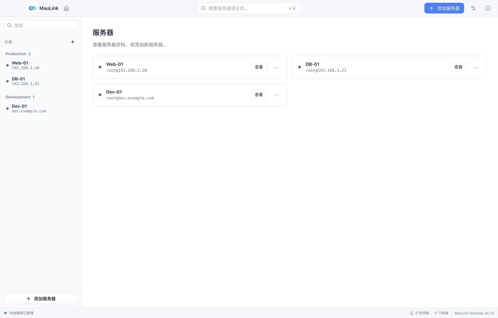
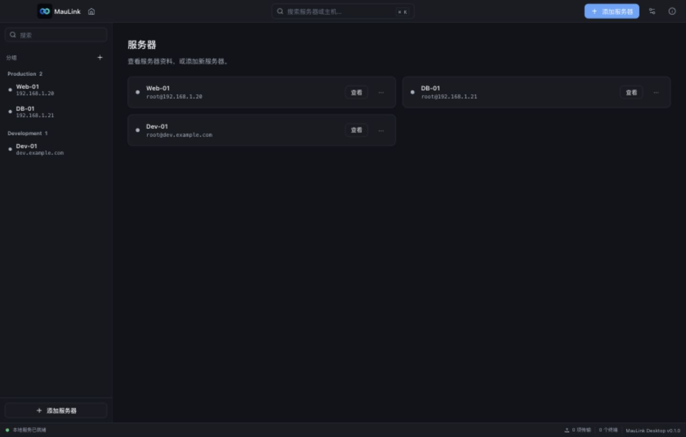
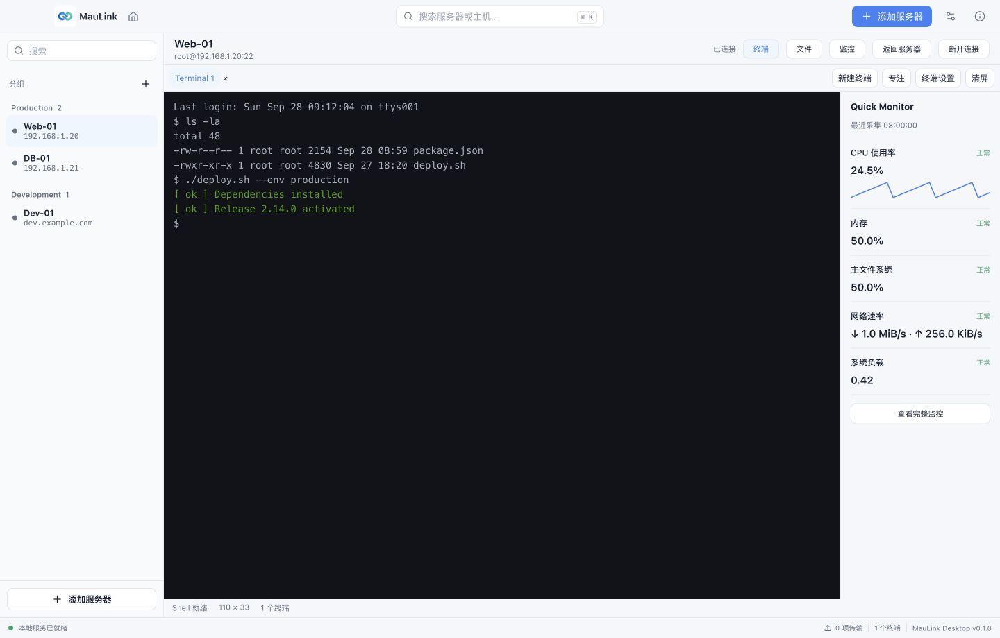
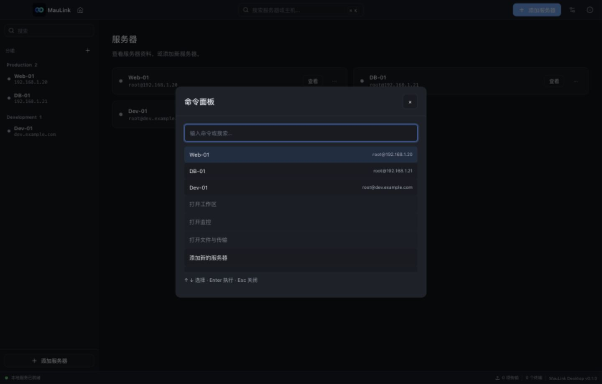
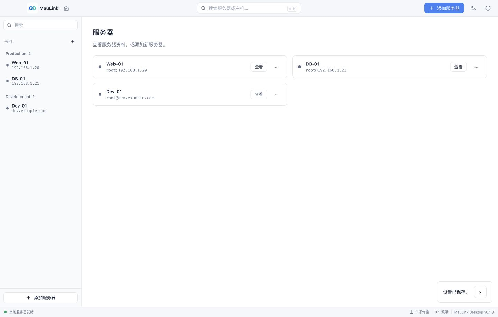
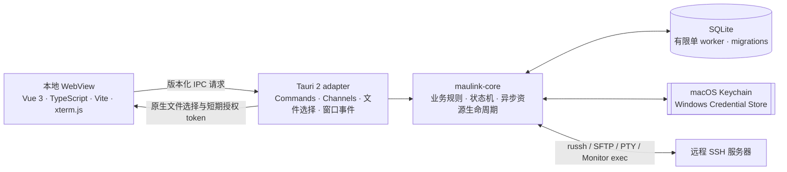

<div align="center">
  <picture>
    <source media="(prefers-color-scheme: dark)" srcset="./frontend/src/assets/app-icon-dark.png">
    <source media="(prefers-color-scheme: light)" srcset="./frontend/src/assets/app-icon-light.png">
    
  </picture>
  <h1>MauLink</h1>
  <p><strong>连接服务器，专注工作。</strong></p>
  <p>将 SSH 终端、远程文件与主机监控，收进一个本地桌面工作台。</p>
  <p>
    
    
    
    
    
  </p>
  <p>
    <a href="#界面预览">界面预览</a> ·
    <a href="#核心能力">核心能力</a> ·
    <a href="#快速开始">快速开始</a> ·
    <a href="#架构与工程">架构与工程</a> ·
    <a href="#验证与发布状态">验证与发布状态</a>
  </p>
</div>

---

MauLink 面向需要经常登录远程主机的开发者。服务器按组组织，连接后在同一工作区切换终端、文件和监控；应用直接从本机连接远端，不依赖 MauLink 云服务或自建中间端。

**本地优先** · **明确的主机信任** · **统一连接工作区** · **浅深主题 / 中文与 English**

当前处于开发与内部试用阶段，目标平台为 macOS、Windows。已验证 macOS arm64 本机测试包；Windows 真机验收、发行签名及 macOS 公证尚未完成。

## 界面预览

<table>
  <tr>
    <th>浅色 · 清晰的服务器入口</th>
    <th>深色 · 统一的工作台外观</th>
  </tr>
  <tr>
    <td></td>
    <td></td>
  </tr>
</table>

<details>
<summary><strong>展开查看终端与 Quick Monitor 工作区</strong></summary>



</details>

<details>
<summary><strong>展开查看统一下拉控件与顶部操作反馈</strong></summary>





</details>

截图来自当前 MauLink Blue 配色的实际 Vue 界面，服务器、终端输出和监控指标使用 Browser Harness 的隔离测试数据。固定场景与截图校验方式见 [视觉回归说明](./frontend/visual/README.md)。

## 核心能力

| 工作场景 | MauLink 提供的能力 |
| --- | --- |
| **管理服务器** | 服务器与分组的新增、编辑、删除和搜索；revision 冲突检查，避免静默覆盖 |
| **建立 SSH 连接** | 密码 / 私钥认证、单跳 Jump Host、SOCKS5 / HTTP CONNECT 代理、连接测试、取消、超时与 keepalive |
| **确认主机身份** | 首次连接确认 Host Key；已信任密钥变化时默认拒绝，核实后显式更新 |
| **使用终端** | 多个独立 PTY、尺寸自适应、专注模式、字体与光标设置；xterm.js 随应用本地分发 |
| **管理远程文件** | SFTP 分页浏览、属性查询、新建目录、重命名、删除、单文件上传 / 下载；不超过 2 MiB 的普通文本查看与编辑、Markdown 预览及保存冲突检查 |
| **查看主机状态** | Quick / Full Monitor 共用快照；CPU、内存、根文件系统、网络、负载、运行时间及数据质量状态 |
| **调整工作环境** | 系统 / 浅色 / 深色主题、简体中文 / English、命令面板、终端偏好与断开确认 |
| **保存在本机** | SQLite 保存配置、Host Key 与设置；每台服务器可选择将密码或私钥口令存入系统凭据库，或以 AES-GCM 加密保存在本地数据库 |

Jump Host 沿用目标服务器的认证方式和凭据，可用 `user@host` 指定不同用户名。代理目前支持无认证 SOCKS5 和 HTTP CONNECT。远程文本查看与编辑仅支持不超过 2 MiB 的普通文件；二进制文件预览 / 编辑、Docker 管理、数据库客户端、进程列表及 Disk I/O 监控不在当前实现范围内。

### 图标与外观

界面采用 **MauLink Blue + White / Slate Neutral**：浅色 Primary 为 `#3B82F6`，深色为 `#60A5FA`。主按钮、焦点和选中态共享语义 Token；页面、侧栏与卡片使用中性色，成功、提醒和危险操作使用各自的状态色。

Reka UI 通过现有 `Base*` 组件统一下拉选择、菜单、弹窗和切换控件，支持键盘导航、焦点恢复与边缘自动定位。操作提示在应用顶部居中，以绿色成功、蓝色信息、橙色警告和红色错误文字提供反馈，按内容收缩并自动消失；需要确认的危险操作仍使用确认弹窗。动画保持轻量，并提供减少动态效果的样式支持。

品牌 Logo 随浅深主题切换；设置中的「应用图标样式」独立选择浅色或深色，保存后更新运行图标并在重启后恢复。macOS Dock 使用所选样式，**Finder 固定使用浅色圆角安装图标**。图标使用真实透明圆角；运行时切换见 [app_icon.rs](./src-tauri/src/app_icon.rs)，资源生成见 [generate-app-icons.mjs](./tools/generate-app-icons.mjs)。

## 快速开始

### 准备环境

| 环境 | 要求 |
| --- | --- |
| Rust | stable，最低 `1.89`；包含 `rustfmt`、`clippy` |
| Node.js | `^20.19.0 || >=22.12.0`，使用 npm |
| Tauri CLI | `2.12.0` |
| macOS | Xcode 或 Xcode Command Line Tools |
| Windows | MSVC C++ Build Tools、Microsoft Edge WebView2 Runtime |

平台依赖参考 [Tauri 2 官方前置要求](https://v2.tauri.app/start/prerequisites/)。以下命令在仓库根目录执行。

### 启动桌面开发版

```bash
cargo install tauri-cli --version 2.12.0 --locked
npm --prefix frontend ci
cargo tauri dev
```

Tauri 自动启动 Vite 并加载 Vue 前端，支持 HMR；请先停止独立 Vite 服务，避免 `1420` 端口冲突。正式应用标识为 `io.maulink.desktop`，使用正式本机数据目录。

### 只调试前端

```bash
npm --prefix frontend run dev
```

打开 `http://127.0.0.1:1420/?harness=visual&page=servers&theme=light&locale=zh-CN`，使用 DEV-only Typed Mock IPC 验证界面，数据与正式资料隔离。`http://127.0.0.1:1420/?harness=interaction` 提供基础控件、键盘、弹层和提示的独立预览。普通 Browser 入口需要 Native IPC；Harness 不进入 release。更多场景见 [前端开发说明](./frontend/README.md) 和 [视觉回归说明](./frontend/visual/README.md)。

### 构建应用

```bash
# 构建当前平台的默认 bundle
cargo tauri build -- --locked

# macOS：仅生成 .app
cargo tauri build --bundles app --ci -- --locked
```

产物位于 `target/release/bundle/`；macOS 应用为 `target/release/bundle/macos/MauLink.app`。当前 macOS 验收包使用本机 ad-hoc 签名，未公证，属于开发测试包。平台限制与验收日期见[验证与发布状态](#验证与发布状态)。

<details>
<summary><strong>macOS 内部打包与签名检查</strong></summary>

对本机测试包签名并检查：

```bash
codesign --force --sign - target/release/bundle/macos/MauLink.app
codesign --verify --deep --strict --verbose=2 target/release/bundle/macos/MauLink.app
```

内部分发 ZIP 可用 `ditto` 保留 bundle 元数据：

```bash
ditto -c -k --sequesterRsrc --keepParent \
  target/release/bundle/macos/MauLink.app \
  target/release/bundle/macos/MauLink_0.1.0_aarch64.zip
```

ad-hoc 签名不能替代 Developer ID 和公证。历史 ZIP 不代表最新构建；需自行重新生成。

</details>

## 架构与工程

MauLink 将 WebView 与系统能力之间的边界收在 Tauri adapter 中；业务规则、数据访问和 SSH 子系统位于可独立测试的 Rust library `maulink-core`。



### 分层职责

| 层 | 路径 | 职责 |
| --- | --- | --- |
| 前端 | `frontend/` | 页面与交互、IPC 调用、终端输出解析和确认；不直接访问本机任意文件或数据库 |
| Tauri adapter | `src-tauri/src/` | 注册 command、校验请求 envelope、适配 Tauri Channel、组装服务、处理应用启动和退出 |
| 业务核心 | `crates/maulink-core/src/` | Profile、凭据、Host Key、连接、Terminal、SFTP、Monitor、设置和存储业务规则 |
| 类型契约 | `crates/maulink-core/src/contracts/`、`contracts/v1/` | Rust DTO、稳定 IPC payload 与由 Rust 导出的 TypeScript 类型 |
| 本地持久化 | `crates/maulink-core/migrations/` | SQLite schema 与有版本的数据库迁移 |

正式前端使用 Vue 3、精确固定的 TypeScript 5.9.3 与 Vite；Reka UI 管理复杂控件交互，项目 CSS 和语义 Token 管理外观，模块化 @tauri-apps/api 调用既有 Typed IPC。xterm.js、fit addon 和图标随本地 bundle 分发，应用运行不需要访问 CDN。DEV Harness 仅用于开发验收，不进入 release。

<details>
<summary><strong>版本化 IPC 契约与流控</strong></summary>

业务 command 使用版本化请求 envelope；只读应用信息接口 `app_get_info` 保留无 envelope 的签名：

```json
{
  "apiVersion": 1,
  "requestId": "uuid",
  "payload": {}
}
```

`requestId` 用于把结构化错误关联回调用方。错误包含稳定 `code`、本地化键 `messageKey`、可重试状态、阶段和可选参数；UI 不应依赖 Rust 底层错误文本。大整数序列号使用十进制字符串，避免 JavaScript `Number` 精度损失。长流数据使用 Tauri Channel；Terminal 输出通过 ACK 反馈消费进度，而不是把“消息已发送”当作“前端已处理”。

TypeScript DTO 由 `ts-rs` 根据 Rust 类型生成，生成后保存在 `contracts/v1/`。修改共享 payload 或序列化语义时，应同时更新 Rust DTO、生成类型和契约测试。

</details>

### 安全与本机数据

- **凭据按服务器选择存储方式。**密码和私钥口令可保存在 macOS Keychain / Windows Credential Manager，或以 AES-GCM 加密后写入本机 SQLite；凭据不会以明文写入数据库或普通配置文件。切换存储方式时，在保存服务器配置时迁移已保存凭据；系统凭据服务不可用时不会静默回退到明文文件。
- **凭据更新可恢复。**数据库记录 `pending_write`、`pending_delete` 和 `retained` 等状态，使 SQLite 与系统凭据存储之间的失败可以在后续启动时识别和清理。
- **Host Key 变化默认拒绝。**信任按规范化的主机与端口绑定；未知密钥需要用户决定，密钥变化不会自动接受。
- **本机文件由原生选择器授权。**前端拿到的是短期、用途绑定的 token，而非任意本地路径。默认有效期为 10 分钟，token 注册容量为 64 项；上传和下载 token 消费后失效，私钥选择 token 可在过期前供对应连接使用。
- **文件管理走 SFTP subsystem。**远端路径按 POSIX 规则处理，不通过拼接 shell 命令完成文件操作；上传与下载使用有界数据块和临时目标发布流程。
- **Monitor 不接收前端命令。**采集使用后端固定脚本与限时、有界输出；服务器返回的文本不会作为可执行指令再运行。
- **Tauri command 使用显式 capability。**主窗口只获准调用产品需要的 command；应用加载本地打包页面并配置内容安全策略。
- **退出与取消有资源边界。**连接拥有 Terminal、SFTP、传输和 Monitor 子资源；断开或应用退出会按生命周期顺序取消并关闭这些资源。

这些措施减少敏感数据暴露和失控资源风险；它们不代表 WebView、操作系统、SSH 服务器或第三方库中的所有内存副本都能被彻底擦除。

### 本机数据位置

应用通过 Tauri 获取当前操作系统的 app data 目录，在其中创建 `maulink.sqlite3` 并运行数据库迁移。具体路径随操作系统和用户账户而异。Unix 系统下应用会将该应用数据目录权限设为 `0700`。服务器配置、设置和 Host Key 等应用数据保存在本机；远程 Terminal 内容不会同步到云端。

<details>
<summary><strong>技术栈与项目结构</strong></summary>

### 技术栈

| 技术 | 用途 |
| --- | --- |
| Rust 2024 edition，最低 Rust `1.89` | 桌面后端与业务核心 |
| Tauri `2.11.6` | 桌面窗口、IPC、系统集成与应用打包 |
| Tokio | 异步网络任务、取消与资源生命周期 |
| `russh 0.63.3` | SSH 客户端、认证、PTY 与 exec channel |
| `russh-sftp 3.0.0` | SFTP 目录操作和文件传输 |
| `rusqlite 0.38`，bundled SQLite | 本地数据库、事务、迁移与备份 |
| `keyring-core` 与平台原生实现 | 系统凭据存储抽象 |
| Vue 3 / TypeScript 5.9.3 / Vite | 桌面 WebView 页面与构建 |
| xterm.js `5.5.0`、addon-fit `0.10.0` | 本地打包的终端显示与布局适配 |

`Cargo.lock` 固定 Rust 依赖解析结果；前端依赖版本由 `frontend/package.json` 和 `frontend/package-lock.json` 固定。

### 项目结构

```text
.
├── Cargo.toml                     # Rust workspace 与统一依赖版本
├── Cargo.lock                     # Rust 依赖锁定
├── rust-toolchain.toml            # stable、rustfmt、clippy
├── contracts/v1/                  # 生成的 TypeScript IPC DTO
├── crates/maulink-core/
│   ├── migrations/                # SQLite schema migrations
│   ├── src/
│   │   ├── contracts/             # IPC 数据结构与序列化
│   │   ├── connections.rs         # 连接注册表与生命周期
│   │   ├── credentials.rs         # 凭据引用、恢复和系统 store
│   │   ├── host_keys.rs           # 主机密钥校验与信任记录
│   │   ├── local_files.rs         # 本地文件 token
│   │   ├── monitor.rs             # 指标采集、质量和历史
│   │   ├── profiles.rs            # 服务器与分组
│   │   ├── settings.rs            # 类型化应用设置
│   │   ├── ssh.rs                 # SSH 连接与认证
│   │   ├── sftp.rs                # SFTP 与传输管理
│   │   ├── terminal.rs            # PTY 与 Terminal 流控
│   │   └── storage.rs             # SQLite worker 与迁移
│   └── tests/                     # 序列化与 OpenSSH 集成测试
├── frontend/
│   ├── index.html
│   ├── package.json / package-lock.json
│   ├── src/                       # Vue 组件、stores、Typed IPC、DEV Harness
│   ├── tests/                     # Vitest 组件与业务测试
│   └── visual/                    # CUA 视觉回归场景、截图保护与校验
├── src-tauri/
│   ├── capabilities/main.json     # 主窗口权限清单
│   ├── src/                       # command adapter 与应用装配
│   ├── tauri.conf.json            # Tauri 窗口与安全策略
│   └── tauri.harness.conf.json    # 开发用 IPC harness 配置
├── tools/ipc-harness/             # 临时 IPC 调试页面，不是产品界面
├── docs/                          # PRD、技术设计、UX 与验收记录
```

`target/`、`src-tauri/gen/` 和 `src-tauri/permissions/autogenerated/` 是构建生成目录，由 `.gitignore` 排除。`contracts/v1/` 是需要随接口变更一并审查的生成源代码，不应按构建缓存清理。

</details>

## 开发与质量检查

前端和 Rust 检查分别执行；真实 OpenSSH 与大文件压力测试按需启动。

<details>
<summary><strong>展开检查命令、集成测试与类型生成</strong></summary>

常规 Rust 检查：

```bash
cargo fmt --all -- --check
cargo clippy --workspace --all-targets --locked -- -D warnings
cargo test --workspace --locked
cargo check --workspace --all-targets --locked
```

前端类型检查、单元测试与构建：

```bash
npm --prefix frontend run type-check
npm --prefix frontend run test
npm --prefix frontend run build
node --test frontend/visual/capture.test.mjs
node frontend/visual/verify.mjs
```

真实 OpenSSH 生命周期、Terminal 和 SFTP 集成测试默认标记为 ignored；它们会启动隔离的 loopback OpenSSH fixture，不使用用户的 SSH 配置或私钥。按需运行，例如：

```bash
cargo test -p maulink-core --test openssh_lifecycle --locked -- --ignored --nocapture
cargo test -p maulink-core --test openssh_terminal --locked -- --ignored --nocapture
cargo test -p maulink-core --test openssh_sftp openssh_sftp --locked -- --ignored --nocapture
```

SFTP 另有覆盖 100 MiB、1 GiB 和 10 GiB 文件的长时间压力测试。它会占用明显的磁盘空间和运行时间，不属于默认测试套件；仅应在有足够空间和时间的专用环境中启动。

重新生成共享 TypeScript 类型：

```bash
cargo run -p maulink-core --example export_bindings --locked
```

执行后检查 `contracts/v1/` 的 diff，确认生成变化与 Rust DTO 一致。`tools/ipc-harness/` 仅用于开发验证，不属于正式产品窗口；它可通过下面的独立 Tauri 配置启动：

```bash
cargo tauri dev --config src-tauri/tauri.harness.conf.json
```

RustRover 的 Cargo Run Configuration：Working directory 为仓库根目录，Command 为 `tauri dev`；构建配置用 `tauri build --bundles app -- --locked`。详细隔离配置与 Browser Harness 命令见 [frontend 开发说明](./frontend/README.md)。

</details>

## 验证与发布状态

以下验收状态按历史记录日期汇总：后端截至 **2026-09-28**，前端组件与交互截至 **2026-10-02**。2026-10-03 新增的远程文本查看 / 编辑，以及 2026-10-08 的服务器凭据、网络信息和详情页更新，不在这些历史验收结果内。前端截至 2026-10-02 的记录包含类型检查、136/136 项测试、Browser 键盘与弹层实测、184 张视觉截图复验、macOS arm64 构建及签名校验；本机 Windows 交叉构建因缺少 MSVC SDK 头文件失败，仍为 BLOCKED。System-Dark 与系统 Reduced Motion 尚未专项实测；这些结果不代表完整双平台 QA。

| 范围 | 当前状态 | 仍需完成 |
| --- | --- | --- |
| M1–M3：核心骨架、数据/凭据、SSH | 核心实现和相应单元/隔离 OpenSSH 测试通过；M3 Windows MSVC 交叉编译通过 | Windows 原生凭据服务、网络行为、路径与安装包真机验收 |
| M4：Terminal | PTY、多终端、取消与有界流控实现；本机 OpenSSH 压力场景通过 | 真实 WebView/Tauri IPC 吞吐与延迟测量尚未完成，因此不登记为完整性能验收通过 |
| M5：SFTP | 浏览、目录操作、文件传输及不超过 2 MiB 的普通文本查看 / 编辑已实现；2026-09-28 的隔离 OpenSSH 和大文件往返验证覆盖文件传输 | 补充文本查看 / 编辑与 Markdown 预览验收；Windows 文件发布与目标服务器故障矩阵验收 |
| M6：Monitor | 采集、解析、有限历史和工作区页面实现；当前可用环境检查通过 | Linux 主机实测指标比对、Windows 窗口最小化/恢复行为验收 |
| 桌面 UI | Vue 正式入口与 Reka UI 组件；Browser 双语、双主题与固定视觉回归；macOS release 应用经用户确认 | Phase 6 既有验收缺口、系统主题/减少动态效果专项实测、原生最小化/恢复；Windows 构建环境及桌面验收 |
| 发布 | 本机开发 bundle 可用 | Developer ID / Windows 签名、macOS 公证、DMG 和公开发行检查 |

当前界面提供简体中文与 English catalog；用户名称、远端路径和终端输出保持原内容。MVP 当前不包含 Docker 管理、数据库客户端、进程列表和 Disk I/O 监控。M4 IPC 数值测试按用户选择跳过，README 不提供未经实测的吞吐或延迟数据。

开发与视觉回归说明：

- [前端开发说明](./frontend/README.md)
- [视觉回归说明](./frontend/visual/README.md)
- [历史设计 QA 记录](./design-qa.md)（截至 2026-10-01，不包含之后新增的远程文本查看 / 编辑）

## 文档导航

| 关注内容 | 入口 |
| --- | --- |
| 开发与运行 | [前端开发说明](./frontend/README.md) · [项目结构](#项目结构) |
| 视觉回归 | [视觉回归说明](./frontend/visual/README.md) |
| 历史验收 | [设计 QA 记录](./design-qa.md)（截至 2026-10-01） |

## 贡献约定

- 保持 `maulink-core` 不依赖 Tauri UI 类型；Tauri command 负责边界适配，不复制业务状态机和存储规则。
- 修改 IPC 时，检查 Rust DTO、生成的 `contracts/v1/`、Tauri permissions/capabilities、前端调用方和契约测试。
- 异步资源必须有容量、取消路径和关闭行为；不要用无限队列掩盖背压。
- 不提交真实服务器地址、用户名、密钥、凭据、私有 fixture 或未脱敏诊断数据。
- 改动完成后运行与改动范围匹配的 Rust 和前端检查，并将平台未验收项写进 `docs/verification/`。
- Git 提交标题和正文使用简体中文；代码标识符、命令、文件名及技术名称保留原文。

## 许可证

Rust workspace manifest 声明 `MIT OR Apache-2.0`，仓库根目录尚未包含对应许可证文本，公开发行前仍需补齐并确认。第三方图标许可证见 [Lucide LICENSE](./frontend/LICENSE-lucide)。
