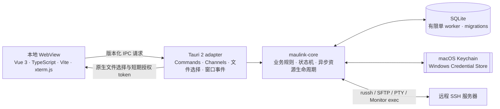

# MauLink

**MauLink 是一款面向开发者的本地 SSH 服务器工作台。**它用一个桌面应用整合服务器配置、SSH 连接、交互式终端、SFTP 文件管理、文件传输和服务器状态监控。应用直接从本机连接远端服务器，不依赖 MauLink 云服务或自建中间端。

> 当前版本：`0.1.0` · 产品目标平台：macOS、Windows · 当前发行状态：开发与内部试用

## 能力概览

| 区域 | 当前实现 |
| --- | --- |
| 服务器管理 | 保存、编辑、删除服务器配置；分组、搜索、配置 revision 与并发冲突检查 |
| SSH 连接 | 密码与私钥认证、单跳 SSH Jump Host、SOCKS5 / HTTP CONNECT 代理、连接取消、超时与 keepalive、临时测试连接 |
| 服务器身份 | 首次连接明确确认 Host Key；已保存的主机密钥发生变化时失败关闭，可在核对后显式更新 |
| Terminal | 多个独立 PTY、尺寸调整、输入序号、输出确认与有界背压；前端使用本地打包的 xterm.js |
| Files / SFTP | 目录分页、属性查询、新建目录、重命名、删除、单文件上传与下载、任务进度和取消 |
| Monitor | CPU、内存、根文件系统、网络、负载、运行时间与系统信息；含指标质量状态和有限历史 |
| 设置 | 主题、语言偏好、终端字体/字号/光标/滚动缓冲区、断开确认偏好 |
| 本机存储 | SQLite 版本化迁移、服务器和分组、Host Key、设置与凭据引用元数据 |

Jump Host 使用当前服务器配置的同一认证方式和凭据；`user@host` 可为跳板机指定不同用户名。代理支持无认证 SOCKS5 和 HTTP CONNECT，代理凭据认证当前不在连接配置中提供。

功能已经进入可运行的桌面应用，但**功能实现不等于双平台发布验收完成**。Vue 前端已正式接入；当前 macOS arm64 `.app` 构建与 Browser 证据见 [Phase 12 报告](./docs/refactor/frontend-v2-phase-12.md)。Windows 真机运行、签名发行和完整 UI 运行时验收仍在待办范围内。详见[当前验证与限制](#当前验证与限制)。

## 架构

MauLink 将 WebView 与系统能力之间的边界收在 Tauri adapter 中；业务规则、数据访问和 SSH 子系统位于可独立测试的 Rust library `maulink-core`。



### 分层职责

| 层 | 路径 | 职责 |
| --- | --- | --- |
| 前端 | `frontend/` | 页面与交互、IPC 调用、终端输出解析和确认；不直接访问本机任意文件或数据库 |
| Tauri adapter | `src-tauri/src/` | 注册 command、校验请求 envelope、适配 Tauri Channel、组装服务、处理应用启动和退出 |
| 业务核心 | `crates/maulink-core/src/` | Profile、凭据、Host Key、连接、Terminal、SFTP、Monitor、设置和存储业务规则 |
| 类型契约 | `crates/maulink-core/src/contracts/`、`contracts/v1/` | Rust DTO、稳定 IPC payload 与由 Rust 导出的 TypeScript 类型 |
| 本地持久化 | `crates/maulink-core/migrations/` | SQLite schema 与有版本的数据库迁移 |

正式前端使用 Vue 3、精确固定的 TypeScript 5.9.3 与 Vite；模块化 @tauri-apps/api 调用既有 Typed IPC。xterm.js、fit addon 和图标随本地 bundle 分发，应用运行不需要访问 CDN。DEV Harness 仅用于开发验收，不进入 release。

### IPC 契约

所有应用 command 使用版本化请求 envelope：

```json
{
  "apiVersion": 1,
  "requestId": "uuid",
  "payload": {}
}
```

`requestId` 用于把结构化错误关联回调用方。错误包含稳定 `code`、本地化键 `messageKey`、可重试状态、阶段和可选参数；UI 不应依赖 Rust 底层错误文本。大整数序列号使用十进制字符串，避免 JavaScript `Number` 精度损失。长流数据使用 Tauri Channel；Terminal 输出通过 ACK 反馈消费进度，而不是把“消息已发送”当作“前端已处理”。

TypeScript DTO 由 `ts-rs` 根据 Rust 类型生成，生成后保存在 `contracts/v1/`。修改共享 payload 或序列化语义时，应同时更新 Rust DTO、生成类型和契约测试。

## 安全与数据边界

- **凭据不写入普通配置字段。**密码和私钥口令通过系统凭据服务保存：macOS Keychain 或 Windows Credential Store。SQLite 保存引用和恢复状态，不保存凭据明文；原生凭据服务不可用时不回退到明文文件。
- **凭据更新可恢复。**数据库记录 `pending_write`、`pending_delete` 和 `retained` 等状态，使 SQLite 与系统凭据存储之间的失败可以在后续启动时识别和清理。
- **Host Key 变化默认拒绝。**信任按规范化的主机与端口绑定；未知密钥需要用户决定，密钥变化不会自动接受。
- **本机文件由原生选择器授权。**前端拿到的是短期、用途绑定的 token，而非任意本地路径。默认有效期为 10 分钟，token 注册容量为 64 项；上传和下载 token 消费后失效，私钥选择 token 可在过期前供对应连接使用。
- **文件管理走 SFTP subsystem。**远端路径按 POSIX 规则处理，不通过拼接 shell 命令完成文件操作；上传与下载使用有界数据块和临时目标发布流程。
- **Monitor 不接收前端命令。**采集使用后端固定脚本与限时、有界输出；服务器返回的文本不会作为可执行指令再运行。
- **Tauri command 使用显式 capability。**主窗口只获准调用产品需要的 command；应用加载本地打包页面并配置内容安全策略。
- **退出与取消有资源边界。**连接拥有 Terminal、SFTP、传输和 Monitor 子资源；断开或应用退出会按生命周期顺序取消并关闭这些资源。

这些措施减少敏感数据暴露和失控资源风险；它们不代表 WebView、操作系统、SSH 服务器或第三方库中的所有内存副本都能被彻底擦除。

### 本机数据位置

应用通过 Tauri 获取当前操作系统的 app data 目录，在其中创建 `maulink.sqlite3` 并运行数据库迁移。具体路径随操作系统和用户账户而异。Unix 系统下应用会将该应用数据目录权限设为 `0700`。服务器配置、设置和 Host Key 等应用数据保存在本机；远程 Terminal 内容不会同步到云端。

## 技术栈

| 技术 | 用途 |
| --- | --- |
| Rust 2024 edition，最低 Rust `1.89` | 桌面后端与业务核心 |
| Tauri `2.11.6` | 桌面窗口、IPC、系统集成与应用打包 |
| Tokio | 异步网络任务、取消与资源生命周期 |
| `russh 0.63.3` | SSH 客户端、认证、PTY 与 exec channel |
| `russh-sftp 3.0.0` | SFTP 目录操作和文件传输 |
| `rusqlite 0.38`，bundled SQLite | 本地数据库、事务、迁移与备份 |
| `keyring-core` 与平台原生实现 | 系统凭据存储抽象 |
| Vue 3 / TypeScript 5.9.3 / Vite | 桌面 WebView 页面与构建 |
| xterm.js `5.5.0`、addon-fit `0.10.0` | 本地打包的终端显示与布局适配 |

`Cargo.lock` 固定 Rust 依赖解析结果；依赖版本和选择背景见[依赖决策记录](./docs/technical-decisions/dependencies.md)。

## 项目结构

```text
.
├── Cargo.toml                     # Rust workspace 与统一依赖版本
├── Cargo.lock                     # Rust 依赖锁定
├── rust-toolchain.toml            # stable、rustfmt、clippy
├── contracts/v1/                  # 生成的 TypeScript IPC DTO
├── crates/maulink-core/
│   ├── migrations/                # SQLite schema migrations
│   ├── src/
│   │   ├── contracts/             # IPC 数据结构与序列化
│   │   ├── connections.rs         # 连接注册表与生命周期
│   │   ├── credentials.rs         # 凭据引用、恢复和系统 store
│   │   ├── host_keys.rs           # 主机密钥校验与信任记录
│   │   ├── local_files.rs         # 本地文件 token
│   │   ├── monitor.rs             # 指标采集、质量和历史
│   │   ├── profiles.rs            # 服务器与分组
│   │   ├── settings.rs            # 类型化应用设置
│   │   ├── ssh.rs                 # SSH 连接与认证
│   │   ├── sftp.rs                # SFTP 与传输管理
│   │   ├── terminal.rs            # PTY 与 Terminal 流控
│   │   └── storage.rs             # SQLite worker 与迁移
│   └── tests/                     # 序列化与 OpenSSH 集成测试
├── frontend/
│   ├── index.html
│   ├── package.json / package-lock.json
│   ├── src/                       # Vue 组件、stores、Typed IPC、DEV Harness
│   ├── tests/                     # Vitest 组件与业务测试
│   └── visual/                    # CUA 视觉回归场景、截图保护与校验
├── src-tauri/
│   ├── capabilities/main.json     # 主窗口权限清单
│   ├── src/                       # command adapter 与应用装配
│   ├── tauri.conf.json            # Tauri 窗口与安全策略
│   └── tauri.harness.conf.json    # 开发用 IPC harness 配置
├── tools/ipc-harness/             # 临时 IPC 调试页面，不是产品界面
├── docs/                          # PRD、技术设计、UX 与验收记录
└── UI/                            # UI 设计说明与原型素材
```

`target/`、`src-tauri/gen/` 和 `src-tauri/permissions/autogenerated/` 是构建生成目录，由 `.gitignore` 排除。`contracts/v1/` 是需要随接口变更一并审查的生成源代码，不应按构建缓存清理。

## 开发环境

- Rust stable；项目声明的最低版本为 Rust `1.89`。`rust-toolchain.toml` 同时请求 `rustfmt` 和 `clippy`。
- Tauri CLI `2.12.0`。
- macOS 桌面构建需要 Xcode 或 Xcode Command Line Tools。
- Windows 桌面构建需要 MSVC C++ Build Tools 和 Microsoft Edge WebView2 Runtime。
- Node.js `^20.19.0 || >=22.12.0` 与 npm；首次执行 `npm --prefix frontend ci`。

系统依赖可能随 Tauri 版本和目标平台变化，安装前请查看 [Tauri 2 官方前置要求](https://v2.tauri.app/start/prerequisites/)。

安装 Tauri CLI：

```bash
cargo install tauri-cli --version 2.12.0 --locked
```

## 运行与构建

首次在项目根目录安装前端依赖，然后运行桌面开发版本；Tauri 自动启动 Vite，先停止独立的 Vite 服务避免端口冲突：

```bash
npm --prefix frontend ci
cargo tauri dev
```

构建当前平台的 release bundle：

```bash
cargo tauri build
```

Tauri 的构建产物位于 `target/release/bundle/`。本机运行环境最近一次已验证的 macOS arm64 `.app` 构建命令为：

```bash
cargo tauri build --bundles app --ci -- --locked
```

内部分发 ZIP 可在 macOS 上用 `ditto` 生成，以保留应用 bundle 元数据：

```bash
ditto -c -k --sequesterRsrc --keepParent \
  target/release/bundle/macos/MauLink.app \
  target/release/bundle/macos/MauLink_0.1.0_aarch64.zip
```

当前 `.app` 为本机 ad-hoc 签名、未公证的开发测试包，不是面向公众发布的安装包；旧 ZIP 未在本轮更新。最新构建与签名验证见 [Phase 12 报告](./docs/refactor/frontend-v2-phase-12.md)，历史记录见[桌面 UI 与打包记录](./docs/verification/desktop-ui-package-2026-09-28.md)。

## 测试与质量检查

常规 Rust 检查：

```bash
cargo fmt --all -- --check
cargo clippy --workspace --all-targets --locked -- -D warnings
cargo test --workspace --locked
cargo check --workspace --all-targets --locked
```

前端类型检查、单元测试与构建：

```bash
npm --prefix frontend run type-check
npm --prefix frontend run test
npm --prefix frontend run build
node --test frontend/visual/capture.test.mjs
node frontend/visual/verify.mjs
```

真实 OpenSSH 生命周期、Terminal 和 SFTP 集成测试默认标记为 ignored；它们会启动隔离的 loopback OpenSSH fixture，不使用用户的 SSH 配置或私钥。按需运行，例如：

```bash
cargo test -p maulink-core --test openssh_lifecycle --locked -- --ignored --nocapture
cargo test -p maulink-core --test openssh_terminal --locked -- --ignored --nocapture
cargo test -p maulink-core --test openssh_sftp openssh_sftp --locked -- --ignored --nocapture
```

SFTP 另有覆盖 100 MiB、1 GiB 和 10 GiB 文件的长时间压力测试。它会占用明显的磁盘空间和运行时间，不属于默认测试套件；请先阅读 [M5 验收记录](./docs/verification/backend-sftp-m5-2026-09-28.md) 再在专用环境中启动。

重新生成共享 TypeScript 类型：

```bash
cargo run -p maulink-core --example export_bindings --locked
```

执行后检查 `contracts/v1/` 的 diff，确认生成变化与 Rust DTO 一致。`tools/ipc-harness/` 仅用于开发验证，不属于正式产品窗口；它可通过下面的独立 Tauri 配置启动：

```bash
cargo tauri dev --config src-tauri/tauri.harness.conf.json
```

RustRover 的 Cargo Run Configuration：Working directory 为仓库根目录，Command 为 `tauri dev`；构建配置用 `tauri build --bundles app -- --locked`。详细隔离配置与 Browser Harness 命令见 [frontend 开发说明](./frontend/README.md)。

## 当前验证与限制

以下后端状态保留 2026-09-28 的验收范围；前端最新迁移、Browser 与 macOS 构建状态更新至 **2026-10-01**，见 [迁移总结](./docs/refactor/frontend-migration-summary.md)。

| 范围 | 当前状态 | 仍需完成 |
| --- | --- | --- |
| M1–M3：核心骨架、数据/凭据、SSH | 核心实现和相应单元/隔离 OpenSSH 测试通过；M3 Windows MSVC 交叉编译通过 | Windows 原生凭据服务、网络行为、路径与安装包真机验收 |
| M4：Terminal | PTY、多终端、取消与有界流控实现；本机 OpenSSH 压力场景通过 | 真实 WebView/Tauri IPC 吞吐与延迟测量尚未完成，因此不登记为完整性能验收通过 |
| M5：SFTP | 浏览、目录操作、文件传输实现；隔离 OpenSSH 回归和大文件往返验证通过 | Windows 文件发布与目标服务器故障矩阵验收 |
| M6：Monitor | 采集、解析、有限历史和工作区页面实现；当前可用环境检查通过 | Linux 主机实测指标比对、Windows 窗口最小化/恢复行为验收 |
| 桌面 UI | Vue 正式入口；Browser 四视口、双语、双主题与固定视觉回归；macOS release 应用 | Phase 6 既有验收缺口、原生最小化/恢复、Windows 桌面验收 |
| 发布 | 本机开发 bundle 可用 | Developer ID / Windows 签名、macOS 公证、DMG 和公开发行检查 |

当前界面提供简体中文与 English catalog；用户名称、远端路径和终端输出保持原内容。MVP 当前不包含 Docker 管理、数据库客户端、进程列表和 Disk I/O 监控。M4 IPC 数值测试按用户选择跳过，README 不提供未经实测的吞吐或延迟数据。

更细的验证结果：

- [后端实施计划](./docs/MauLink_后端开发实施文档_v0.1.md)
- [M3 SSH 验收记录](./docs/verification/backend-ssh-foundation-2026-09-22.md)
- [M4 Terminal 开发与验收记录](./docs/verification/backend-terminal-foundation-2026-09-27.md)
- [M5 SFTP 验收记录](./docs/verification/backend-sftp-m5-2026-09-28.md)
- [M6 Monitor 验收记录](./docs/verification/backend-monitor-m6-2026-09-28.md)
- [桌面 UI 与打包记录](./docs/verification/desktop-ui-package-2026-09-28.md)
- [设计 QA 记录](./design-qa.md)

## 设计与技术资料

- [产品需求文档](./docs/MauLink_PRD_v0.1.md)
- [MVP 功能与验收定义](./docs/MauLink_MVP_设计文档_v0.1.md)
- [UX 设计文档](./docs/MauLink_UX_设计文档_v0.1.md)
- [UI 设计说明](./UI/MauLink_UI_描述文档_v0.1.md)
- [后端开发实施文档](./docs/MauLink_后端开发实施文档_v0.1.md)
- [依赖与技术决策](./docs/technical-decisions/dependencies.md)

## 贡献与变更约定

- 保持 `maulink-core` 不依赖 Tauri UI 类型；Tauri command 负责边界适配，不复制业务状态机和存储规则。
- 修改 IPC 时，检查 Rust DTO、生成的 `contracts/v1/`、Tauri permissions/capabilities、前端调用方和契约测试。
- 异步资源必须有容量、取消路径和关闭行为；不要用无限队列掩盖背压。
- 不提交真实服务器地址、用户名、密钥、凭据、私有 fixture 或未脱敏诊断数据。
- 改动完成后运行与改动范围匹配的 Rust 和前端检查，并将平台未验收项写进 `docs/verification/`。

## 许可证

Rust workspace manifest 当前声明 `MIT OR Apache-2.0`。仓库根目录目前尚未包含对应的 `LICENSE` 文本；在公开发布或再分发源码前，需要补齐并确认许可证文件。
