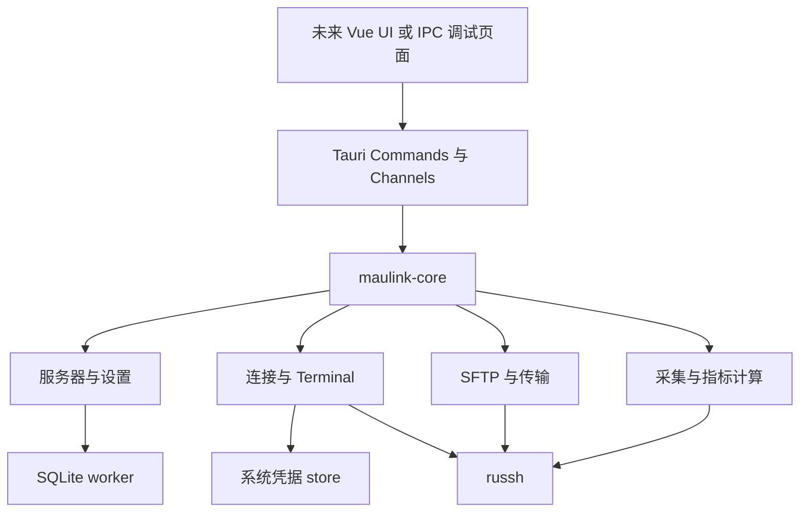

# MauLink 后端开发实施文档

**文档版本：** v0.1  
**编写日期：** 2026-09-22  
**适用阶段：** UI 设计完成前的后端开发与后续 UI 接入  
**需求基线：** MauLink PRD v0.1、MVP 设计文档 v0.1、UX 设计文档 v0.1  
**目标客户端：** Windows、macOS  
**文档状态：** 实施建议，供开发执行和技术评审使用；尚不代表代码已实现或测试已通过。

本阶段先交付可以独立测试的本地 Rust 核心，再通过 Tauri IPC 提供稳定接口。没有正式 UI 时，通过 Rust 集成测试和最小 IPC 调试页面完成服务器管理、SSH、终端数据流、SFTP、监控与凭据存储的验证。正式 UI 后续接入这些接口，不承担连接生命周期、重试、权限判断或指标计算。

本文中的“后端”指桌面应用本地进程内的业务与系统能力，不建设 HTTP 服务、云端账户服务或远程驻留 Agent。产品仍以 Server Workspace 为核心，后端只定义资源与状态，不提前固定页面样式、面板位置或组件库。

## 目录

1. [交付目标与范围](#1-交付目标与范围)
2. [需求对齐与实施决策](#2-需求对齐与实施决策)
3. [技术选型与验证门槛](#3-技术选型与验证门槛)
4. [模块架构与工程目录](#4-模块架构与工程目录)
5. [运行时与资源生命周期](#5-运行时与资源生命周期)
6. [本地数据与迁移](#6-本地数据与迁移)
7. [凭据与服务器身份](#7-凭据与服务器身份)
8. [服务器管理与配置](#8-服务器管理与配置)
9. [SSH 连接与认证](#9-ssh-连接与认证)
10. [Terminal 数据通道](#10-terminal-数据通道)
11. [SFTP 与文件传输](#11-sftp-与文件传输)
12. [服务器监控](#12-服务器监控)
13. [IPC 契约与错误模型](#13-ipc-契约与错误模型)
14. [设置与应用生命周期](#14-设置与应用生命周期)
15. [安全与可观测性](#15-安全与可观测性)
16. [资源预算与性能验证](#16-资源预算与性能验证)
17. [分阶段实施计划](#17-分阶段实施计划)
18. [测试与持续集成](#18-测试与持续集成)
19. [前后端交接与完成标准](#19-前后端交接与完成标准)
20. [风险与待确认事项](#20-风险与待确认事项)
21. [参考资料](#21-参考资料)

## 1 交付目标与范围

### 1.1 可独立验收的后端结果

后端阶段应交付以下结果：

1. `maulink-core` Rust library：可在不启动 WebView 的情况下编译、测试和执行核心工作流。
2. Tauri 桌面适配层：负责 IPC、窗口生命周期、系统文件选择与平台能力接入。
3. 版本化 IPC 契约：请求、响应、状态、错误码、数据流和取消语义，以及生成的 TypeScript 类型。
4. 可重复的 OpenSSH/SFTP 集成测试环境、监控解析 fixture 和故障注入用例。
5. 最小调试页面与场景脚本：用于验证真实 IPC、流控和操作系统行为，不承担正式 UI 设计。
6. 数据库迁移、两平台凭据存储验证、资源清理和性能基线报告。
7. 前端接入说明和明确标注的未完成项。

验收主路径：

```text
创建服务器配置
→ 发起连接
→ 首次确认 Host Key
→ 密码或私钥认证
→ 打开两个独立 PTY Shell
→ 浏览目录与上传下载文件
→ 读取服务器资源指标
→ 取消任务或主动断开
→ 确认资源释放
→ 重启应用后读取配置并重新连接
```

### 1.2 需求追踪

| 编号 | 后端交付内容 | 基线 | 验收证据 |
|---|---|---|---|
| BE-01 | Server CRUD、Group、Search、配置持久化 | MVP 9、31 | 数据仓储测试与真实文件数据库重启测试 |
| BE-02 | Password、SSH Key、Host Key、连接状态 | MVP 10、11、30 | 真实 OpenSSH 认证矩阵与主机密钥更换测试 |
| BE-03 | PTY、输入输出、Resize、多个 Shell、关闭 | MVP 12～15 | 真实 PTY、双终端隔离、流控与大量输出测试 |
| BE-04 | SFTP 浏览、上传、下载、重命名、删除、建目录 | MVP 16、17 | 文件系统操作、权限错误、校验和与大文件测试 |
| BE-05 | CPU、Memory、Disk、Network、Load、Uptime、系统信息 | MVP 18～25 | 解析 fixture、公式测试、Linux 实机比对 |
| BE-06 | Settings、Theme、Language、Terminal Preferences 的保存与通知 | MVP 26～29 | 校验、持久化、更新通知契约测试 |
| BE-07 | 结构化错误、取消、断线状态、局部降级 | MVP 32、33；UX 46、59、61 | 故障注入与状态机测试 |
| BE-08 | 有限缓冲、自适应采样、后台停止、资源释放 | MVP 15、25、38、39、45、46 | 资源计数、压力与持续运行报告 |
| BE-09 | 双平台桌面适配与可运行开发包 | MVP 7、6、48 | Windows/macOS 本机验证记录 |

### 1.3 后端阶段与产品 MVP 的边界

本阶段必须为中文和 IME 提供透明的字节通道，但“中文输入法正确”“Emoji/CJK 宽度正确”还需要正式 Terminal 组件和两平台 UI 测试。主题、语言和字体可先完成设置存储与通知，视觉效果留待 UI 接入验证。

下列事项不能仅凭后端测试宣布完成：首次使用可用性、快捷键与系统习惯、复制粘贴交互、60 FPS、正式窗口冷启动和整体内存、公开展示水平的 UI。后端 Alpha 达标不等于 MVP Beta 达标。

P1 暂不实现自动重连、终端搜索、拖拽上传、可管理的多任务传输队列、进程列表、Terminal 与 Files 当前目录联动。底层仍需提供手动重新连接、单个传输的取消与状态查询，以及供前端调用的稳定接口。

Docker、数据库 GUI、Jump Host、Port Forward、SSH Agent、云同步、多窗口和插件系统不进入本次后端范围。允许未来增加模块，但不为其提前建设通用插件平台或任意命令执行服务。

## 2 需求对齐与实施决策

### 2.1 现有文档的对齐方式

| 差异或未明确项 | 本文采用的实施建议 | 影响 |
|---|---|---|
| PRD 的 v0.2 才列出 Host Key、Credential Storage；MVP 将其列为 P0 | 在第一条可用 SSH 路径中完成 Host Key 校验，保存凭据前完成安全存储 | 不提供跳过校验或明文保存的临时实现 |
| PRD 的 Terminal 基础列表包含 Search，但专门小节及 MVP 将其列为 P1 | 后端 P0 不做终端内容索引和搜索服务 | 搜索后续由有限 Scrollback 的 Terminal 组件实现 |
| PRD 区分 Disk IO 约 2 秒、Filesystem 约 10 秒；MVP 为 Disk 约 5 秒 | P0 的 Disk 明确定义为主文件系统容量，每 5 秒；Disk IO/IOPS 进入后续详细监控 | 避免把容量刷新误当作磁盘吞吐采样 |
| MVP 的 System 为 Once，但 Uptime 应持续变化 | OS、Kernel、Architecture、Hostname 每次连接读取一次；Uptime 随动态指标更新 | 静态信息与动态指标分开 |
| PRD 要求 Remaining，MVP 传输列表未列出 | 契约保留可空 `remainingSeconds`，估计不可靠时返回 `null` | 不显示虚假的剩余时间 |
| UX 的 Test Connection 流程简图省略 Host Key 阶段 | 测试连接和正式连接共用身份校验与认证流程 | 测试连接也不能绕过安全校验 |
| 文档版本号均为 v0.1，产品规划另有 v0.1～v1.0 | 本文用 M0～M8 表示实施里程碑 | 不将文档版本等同于产品完成度 |

以上是为形成可执行计划提出的统一口径，不改写原始需求文件。正式实施前，应将接受的范围决策记录到开发任务和需求变更记录。

### 2.2 默认技术与产品假设

- 客户端仍为本地单用户应用；不增加账户、租户、RBAC 或后台服务。
- P0 监控先支持提供 `/proc` 与基本 POSIX 工具的 Linux/OpenSSH 环境；非 Linux 服务器可独立验证 SSH/SFTP，但不宣称监控兼容。
- 不要求服务器安装 Agent、Python 或 Node.js；不自动安装软件，不自动提权，不调用 `sudo`。
- 每个已保存服务器配置默认只保留一个活动连接；多个 Terminal 对应同一连接下多个独立 Shell channel。该方案必须通过 M0 的流控隔离实验。
- “重新连接”建立新的连接与 Shell，不恢复旧远端进程、PTY 或 tmux 状态。
- 本文出现的缓冲大小、超时与并发数是初始工程参数，不是现有产品承诺，也不全部暴露为用户设置。
- 重名覆盖、非空目录删除、非 UTF-8 路径和最低系统版本尚未由需求文档明确；建议与冻结条件见第 20 节。

## 3 技术选型与验证门槛

### 3.1 建议技术栈

| 能力 | 建议 | 选择依据与限制 |
|---|---|---|
| 桌面宿主 | Tauri 2 | 延续 PRD 的 Tauri 方向；只在适配层使用 Tauri 类型 |
| 核心语言 | Rust stable | 与 Tauri 后端一致；M0 固定具体 toolchain 并提交锁文件 |
| 异步任务 | Tokio、tokio-util | 网络任务、超时、有限 channel、协作取消 |
| SSH | russh | Rust 异步客户端；必须实测 Host Key callback、PTY、认证和 channel 流控 [S3] |
| SFTP | russh-sftp | 接入 SSH subsystem；逐批目录读取、传输与取消都需要实测 [S4] |
| 本地配置 | SQLite + rusqlite | 小规模结构化本地数据，不建设数据库服务；固定 worker 持有连接 [S7] |
| 凭据 | keyring-core + 平台原生 store | macOS Keychain、Windows Credential store；避免引入不需要的平台实现 [S5] |
| DTO 与错误 | serde、serde_json、thiserror | 结构化输入输出与可测试错误分类 |
| TypeScript 契约 | ts-rs | 从 Rust DTO 导出类型；真实序列化 fixture 另行校验 [S10] |
| ID 与敏感内存 | uuid、zeroize | 不透明资源 ID；对自有敏感缓冲做尽力清零 |
| 日志 | tracing、有限文件轮转 | 记录状态、耗时、错误码；不记录终端内容和敏感字段 |

Tauri Channels 适用于有序流式数据，普通 Event 不作为终端大流量传输路径；Channel 之外仍需实现应用级消费确认和容量限制。[S1]

当前 Keyring 官方文档将 `keyring` convenience crate 与 `keyring-core`、平台 store 分开。实施时按所选版本的原生 store API 集成，不直接照搬旧版 `keyring` feature 配置。[S5]

### 3.2 依赖冻结规则

本文不把网页上的 `latest` 当成可重复构建版本。M0 需要记录每个关键依赖的精确版本、feature、MSRV、许可证、平台编译结果与已知风险，形成 `docs/technical-decisions/dependencies.md`。

提交 `Cargo.lock`、`rust-toolchain.toml`；引入调试页面工具链时一并提交前端锁文件。不要同时引入两套 SSH 库、两套数据库访问框架或多个凭据后端作为未经验证的“备用方案”。

### 3.3 M0 必须完成的技术实验

| 实验 | 最小行为 | 通过条件 | 未通过的处理 |
|---|---|---|---|
| SPIKE-01 SSH 基础 | 密码、加密私钥、PTY、Resize、两个 channel | Windows/macOS 均可连接受控 OpenSSH fixture | 修正依赖组合；不得靠禁用 Host Key 通过 |
| SPIKE-02 身份确认 | 在握手回调等待外部确认并可取消 | 拒绝/超时后不认证；过期答复无效 | 先解决握手桥接再开发正式连接管理 |
| SPIKE-03 共享传输流控 | A channel 大量输出且消费者停读，B 持续交互 | 内存有界，B 与取消操作不持续卡死 | 暂停冻结共享 transport 方案，评估独立 transport 的实测代价后另作决策 |
| SPIKE-04 SFTP | 分批目录读取、64-bit offset、取消、关闭 | 10GB 流式传输可行，取消无请求积压，错误可分类 | 调整低层调用或更换选型；记录兼容范围 |
| SPIKE-05 系统凭据 | 原生 store 写入、读取、删除、访问被拒绝 | 两平台真实 store 可用，失败不回退明文 | 定位平台 store 与签名/权限差异 |
| SPIKE-06 IPC 数据流 | 有限 chunk、序号、消费 ACK、页面停读 | Tauri 队列和 WebView 不随输出无限增长 | 优化编码或传输方式后重测 |
| SPIKE-07 私钥格式 | ED25519、RSA SHA-2、加密 OpenSSH；常见 PEM/PKCS#8 样本 | 形成明确格式矩阵，错误密码与不支持格式可区分 | 未覆盖的常见格式作为范围决策，不伪装为认证失败 |

以上实验只做验证所需最小程序和测试，不建设与正式模块重复的框架。实验结论可迁入正式测试。

## 4 模块架构与工程目录

### 4.1 依赖方向



这里只拆两个 crate：可独立测试的核心 library 与已有 Tauri 约定下的 desktop crate。业务模块先使用普通 Rust module 和明确结构体，不再拆分独立微服务、通用 Repository 框架或插件 crate。

### 4.2 建议目录

```text
MauLink/
├── Cargo.toml                      # workspace
├── Cargo.lock
├── rust-toolchain.toml
├── crates/
│   └── maulink-core/
│       ├── Cargo.toml
│       ├── src/
│       │   ├── lib.rs
│       │   ├── app.rs              # Core 组装与关闭
│       │   ├── error.rs
│       │   ├── contracts/          # DTO 与状态枚举
│       │   ├── storage/            # worker、migration、SQL
│       │   ├── profiles.rs
│       │   ├── credentials.rs
│       │   ├── ssh/                # 连接、认证、Host Key
│       │   ├── terminal.rs
│       │   ├── sftp/               # 路径、浏览、操作、传输
│       │   ├── monitor/            # 采集、解析、计算、调度
│       │   └── settings.rs
│       ├── migrations/
│       ├── tests/
│       └── examples/              # 必要的开发验证程序
├── src-tauri/
│   ├── Cargo.toml
│   ├── build.rs
│   ├── tauri.conf.json
│   ├── capabilities/
│   ├── permissions/
│   └── src/
│       ├── lib.rs
│       ├── main.rs
│       ├── commands/
│       ├── streams.rs
│       └── lifecycle.rs
├── contracts/v1/                   # 生成的 TypeScript 与 JSON fixture
├── tools/ipc-harness/              # 最小调试页面，不代表产品 UI
├── tests/fixtures/                 # OpenSSH 配置、监控输出
└── docs/
    ├── technical-decisions/
    └── verification/               # 实测结果，不存敏感数据
```

以上目录按里程碑逐步创建，不在首个提交一次性生成大量空文件。

### 4.3 模块职责

| 模块 | 负责 | 不负责 |
|---|---|---|
| Tauri adapter | 调用来源、DTO、Channels、原生文件选择、窗口事件 | SQL、SSH 协议、指标计算 |
| Profiles | 服务器字段校验、分组、搜索、配置 revision | 活动 Shell 内容 |
| Storage | 参数化 SQL、迁移、事务、持久化错误 | 持有网络连接或明文凭据 |
| Credentials | 原生安全存储、引用生命周期、脱敏 | 向 UI 读取并展示已存密码 |
| Connection manager | 每个连接的状态、认证、取消、子资源登记 | 图表和终端渲染 |
| Terminal | PTY channel、原始字节、Resize、流控 | ANSI 屏幕解释、IME、字体、Scrollback 搜索 |
| SFTP | 远程路径、目录操作、流式传输 | 本地任意文件系统访问服务 |
| Monitor | 能力探测、采样、公式、历史窗口、质量状态 | 执行任意用户输入的命令 |

只在真实外部边界引入便于测试的窄接口，例如凭据 store 和采集输入。状态转换、计算公式与重试由确定性代码完成。

## 5 运行时与资源生命周期

### 5.1 进程与任务模型

- 桌面模式复用 Tauri 提供的异步运行环境；核心方法是 async API，不创建嵌套 runtime、不在 command 中 `block_on`。
- 核心集成测试自己建立 Tokio runtime，因此不依赖 Tauri `AppHandle`。
- SQLite 由一个固定 worker 持有连接，有限请求队列与 oneshot 回答。数据库和系统凭据同步调用不得占用异步网络 worker。
- 凭据调用使用有限并发的阻塞工作通道；同一凭据 ID 的写入/删除串行。不要为每个事件无限创建线程。
- 每个连接拥有取消 token 与所有子任务的 join handle；Terminal、SFTP、Monitor 继承连接取消信号。
- 不持有全局 registry mutex 跨网络 `.await`；复制轻量 handle 后释放锁，再执行 I/O。

Tokio 取消是协作式的；已经开始执行的 `spawn_blocking` 任务不能通过 `abort` 强行终止。凭据操作超时只代表调用方停止等待，后续结果仍需回收，不能马上启动相反操作并假定前一操作已结束。[S6]

### 5.2 资源 ID 与所有权

| ID | 生命周期与用途 |
|---|---|
| `serverId` | 持久化配置的 UUID |
| `connectionId` | 每次连接尝试新建的 UUID；失败、取消、重连都不复用 |
| `terminalId` | 一个 PTY Shell；绑定唯一 connection |
| `transferId` | 一次传输尝试；重试创建新 ID |
| `challengeId` | 一次 Host Key 或认证问题；绑定 connection、端点和有效期 |
| `streamId` | 一次订阅；页面重建后重新申请 |
| `localFileToken` | 原生文件选择生成的临时授权引用；绑定用途与调用窗口 |

前端提交 ID 时，后端检查资源是否存在、是否属于当前调用窗口、是否仍处于允许状态。旧连接的事件和挑战响应不能影响新连接。

临时 draft 只允许 Test Connection；对应快照的 `serverId` 为 `null`，不会创建持久化 Profile 或凭据引用。

### 5.3 停止顺序

```text
拒绝该连接的新操作
→ 取消采样与未完成的身份/认证挑战
→ 停止新传输并取消活动传输
→ 关闭目录句柄与 SFTP 子系统
→ 关闭 PTY channels
→ SSH disconnect 并关闭 socket
→ 等待子任务退出
→ 清理 registry、订阅和敏感缓冲
→ 发布终态
```

正常停止初始预算为 5 秒；超时后中止可取消的异步任务并关闭连接底层 I/O，记录哪些资源未正常退出。操作系统阻塞调用按 5.1 单独处理。不能通过丢弃 `JoinHandle` 假装任务已结束。

切换服务器只改变活跃上下文与监控采样，不关闭其他服务器的 Terminal 或传输。断开连接则必须停止对应后台任务。

## 6 本地数据与迁移

### 6.1 存储分类

| 数据 | 存放位置 | 保留策略 |
|---|---|---|
| Server、Group、Settings、Host Key | 用户应用数据目录内 SQLite | 持久化 |
| Password、Passphrase | 操作系统安全存储 | 用户选择保存时持久化 |
| 私钥 | 用户选择的原文件 | 数据库只保存平台可逆编码的路径引用 |
| Connection、PTY、采样原始值 | 内存 | 断开时清理 |
| Monitor history | 有限内存 ring buffer | 默认最近 15 分钟 |
| Terminal 屏幕与 Scrollback | 未来 Terminal 组件 | 默认 10,000 行；后端不重复存一份 |
| Transfer history | 有限内存 | 重启不恢复传输任务 |
| 应用日志 | 用户应用日志目录 | 文件大小与文件数双重限制 |

开发、测试与正式应用使用不同的 app identifier、数据库目录和凭据命名空间。测试不得读写真实用户服务器列表或系统 `known_hosts`。

### 6.2 初始 schema 草案

下列 SQL 定义关键持久化约束，供 M2 迁移使用。它是设计草案；正式字段变更通过编号 migration，不在应用启动时临时拼接表结构。

```sql
PRAGMA foreign_keys = ON;

CREATE TABLE server_groups (
    id TEXT PRIMARY KEY,
    name TEXT NOT NULL CHECK (length(trim(name)) BETWEEN 1 AND 64),
    sort_order INTEGER NOT NULL DEFAULT 0,
    revision INTEGER NOT NULL DEFAULT 1 CHECK (revision > 0),
    created_at_ms INTEGER NOT NULL,
    updated_at_ms INTEGER NOT NULL
);

CREATE TABLE credential_refs (
    id TEXT PRIMARY KEY,
    owner_server_id TEXT NOT NULL,
    kind TEXT NOT NULL CHECK (kind IN ('password', 'passphrase')),
    state TEXT NOT NULL CHECK (state IN
        ('pending_write', 'active', 'retained', 'pending_delete')),
    created_at_ms INTEGER NOT NULL,
    updated_at_ms INTEGER NOT NULL
);

CREATE TABLE servers (
    id TEXT PRIMARY KEY,
    name TEXT NOT NULL CHECK (length(trim(name)) BETWEEN 1 AND 128),
    host TEXT NOT NULL,
    port INTEGER NOT NULL CHECK (port BETWEEN 1 AND 65535),
    username TEXT NOT NULL CHECK (length(username) BETWEEN 1 AND 256),
    auth_type TEXT NOT NULL CHECK (auth_type IN ('password', 'private_key')),
    private_key_path BLOB,
    private_key_path_encoding TEXT CHECK
        (private_key_path_encoding IN ('unix_bytes', 'windows_utf16le')),
    credential_ref_id TEXT REFERENCES credential_refs(id) ON DELETE SET NULL,
    group_id TEXT REFERENCES server_groups(id) ON DELETE SET NULL,
    connect_timeout_ms INTEGER NOT NULL DEFAULT 15000
        CHECK (connect_timeout_ms BETWEEN 1000 AND 120000),
    keepalive_interval_s INTEGER NOT NULL DEFAULT 30
        CHECK (keepalive_interval_s BETWEEN 5 AND 300),
    revision INTEGER NOT NULL DEFAULT 1 CHECK (revision > 0),
    created_at_ms INTEGER NOT NULL,
    updated_at_ms INTEGER NOT NULL,
    CHECK ((private_key_path IS NULL) = (private_key_path_encoding IS NULL)),
    CHECK (auth_type <> 'private_key' OR private_key_path IS NOT NULL)
);

CREATE INDEX servers_group_id_idx ON servers(group_id);

CREATE TABLE known_hosts (
    normalized_host TEXT NOT NULL,
    port INTEGER NOT NULL CHECK (port BETWEEN 1 AND 65535),
    key_algorithm TEXT NOT NULL,
    public_key_blob BLOB NOT NULL,
    fingerprint_sha256 TEXT NOT NULL,
    revision INTEGER NOT NULL DEFAULT 1 CHECK (revision > 0),
    trusted_at_ms INTEGER NOT NULL,
    PRIMARY KEY (normalized_host, port)
);

CREATE TABLE settings (
    key TEXT PRIMARY KEY,
    value_json TEXT NOT NULL,
    revision INTEGER NOT NULL DEFAULT 1 CHECK (revision > 0),
    updated_at_ms INTEGER NOT NULL
);
```

`credential_refs.owner_server_id` 有意不建立指向 `servers` 的外键：服务器配置删除后，仍需要保留凭据清理记录或用户选择保留的凭据元数据。该字段只记录原拥有者；不能据此复用其他服务器的凭据。

应用层补充校验：credential 的 owner/kind 与服务器匹配；`private_key` 绑定 passphrase，`password` 绑定 password；密码认证不保留无用私钥路径；所有 JSON 设置按已知类型校验。数据库保存的是 keyring 引用，不包含 secret。

首版 `settings` 只写固定 `key='app_settings'` 的整份类型化 JSON，以该行 revision 对应 `settings_get/settings_update` 的整体 revision，不将每个字段的版本号混作一个版本。此表不通过 IPC 暴露任意 key/value 写入能力。

### 6.3 事务与迁移规则

1. 启动时定位用户数据目录，建立本用户访问权限，启动 DB worker。
2. 显式设置 `foreign_keys=ON`、有限 `busy_timeout`；采用 SQLite 默认 rollback journal 即可，不为当前单 worker 场景引入 WAL 调优。
3. 用 `PRAGMA user_version` 维护 schema 版本；一个版本的 migration 在事务中完成。
4. 迁移前用 SQLite backup API 创建一致备份；若无法备份，停止升级并返回可恢复错误。[S7]
5. 当前应用读到更高 schema 版本时返回 `SCHEMA_TOO_NEW`，不降级、不重建空库。
6. 迁移失败回滚并保留原库和诊断；不自动删除数据库。
7. 普通配置修改在单个事务中完成。更新/删除携带 `expectedRevision`，冲突返回 `REVISION_CONFLICT`。
8. 备份最多保留最近 3 份，并限制仅清理本应用生成的备份。日志不输出 SQL 参数值。

SQLite 与系统安全存储不在同一个事务中，其一致性按第 7 节处理，不能以一次 SQLite commit 代表整个凭据操作成功。

## 7 凭据与服务器身份

### 7.1 凭据接口与保存语义

核心提供窄接口 `save`、`load_for_authentication`、`delete`；Tauri 不暴露任意 `get_password` 或凭据明文读取接口。

凭据输入与持久化配置 DTO 分开：

```text
CredentialUpdate = Keep | Clear | Replace(secret)
```

`Keep` 表示沿用当前引用，`Clear` 表示删除保存的 secret，`Replace` 表示明确提交新值。不能用空字符串、缺失字段或掩码占位符混合表示这些含义。

- `Remember Password` 未开启：secret 只在本次认证所需生命周期内存在，不落库、不写缓存文件。
- 输入 secret 的 Rust 类型不派生普通 `Debug`；请求日志、tracing 参数、panic context 均排除此字段。
- Rust 自有缓冲用 `zeroize` 等尽力清理；不承诺清除 WebView、操作系统或第三方库内部的全部副本。
- 已存凭据在 Host Key 校验通过后才读取并用于认证。
- Keychain/Credential store 不可访问时返回明确错误，允许本次临时输入，不回退到明文文件或自制加密。

### 7.2 凭据与数据库的一致性

保存或替换凭据按以下顺序执行：

1. 在 DB 中登记新 UUID 的 `pending_write` 元数据；keyring 项名只由应用命名空间和该 UUID 构成。
2. 在系统 store 写入新 secret。
3. DB 事务将新引用改为 `active`、更新服务器引用，将旧引用标记 `pending_delete`。
4. 删除旧 keyring 项；成功后删除旧元数据，失败则保留 `pending_delete` 并向调用方返回清理警告。

第 2 步失败时保留原有效引用；第 3 步失败时删除新 secret。删除也失败时，保留可追踪的清理记录，不能遗失孤立 secret 的 ID。

应用下次启动时，对 `pending_write` 和 `pending_delete` 做有限清理；只处理本应用命名空间中的已登记 ID。清理与该 ID 的未完成 OS 操作串行，访问被拒绝时停止自动尝试并显示待处理状态，不循环弹系统授权框。

删除服务器时：

- 正在连接、已连接或有传输时先返回 `SERVER_IN_USE`，由调用方完成断开后再删除。
- `removeCredentials=true`：同一 DB 事务删除配置并标记凭据待删除，再调用系统 store。清理未完成必须返回 `credentialCleanupPending=true`。
- `removeCredentials=false`：引用改为 `retained`，保留不含 secret 的管理元数据。后续可列出并显式删除这些保存项，不自动绑定到新服务器。
- 删除配置不自动删除 `known_hosts`：同一端点可能被多个 Profile 使用，信任记录属于服务器端点。

### 7.3 Host Key 身份规则

信任记录按规范化的用户目标 `host + port` 识别，不按 username 或 serverId 识别。DNS 主机名规范化大小写；IPv4/IPv6 使用规范化表示。端口不同视为不同端点，不能因 DNS 解析到相同 IP 就合并信任。

校验比较算法与实际公钥内容，SHA256 fingerprint 用于展示和核对。连接库负责 SSH 协议层的签名验证；应用负责把收到的 key 与信任库绑定。[S3]

| 情况 | 行为 |
|---|---|
| 无记录 | 暂停认证，发出 `HostKeyChallenge`，等待信任并保存或取消 |
| key 与记录一致 | 继续认证 |
| key 不一致，包括未知算法替换 | 默认阻止，提供 previous/current 指纹；只有明确更新记录后继续 |
| 记录读取失败或损坏 | 失败关闭，不当作首次连接 |
| 用户取消、超时或连接已结束 | 拒绝 key，关闭尝试；迟到响应无效 |
| SSH rekey 再次出现 key | 重新执行校验，不因连接曾成功而直接返回 true |

`HostKeyChallenge` 至少包含 `challengeId`、`connectionId`、host、port、algorithm、当前 fingerprint、旧 fingerprint、旧 revision、`expiresAtMs`。初始等待上限 120 秒，可由用户重新发起连接。

确认必须绑定当前握手中已收到的 key，不接受前端传回任意公钥作为写库内容。持久化使用旧 revision 的比较更新；并发窗口或另一尝试已改变信任记录时返回冲突并重新核对，不能覆盖别人的新决定。

MVP 使用独立信任库，不静默导入或覆盖用户 `~/.ssh/known_hosts`。Host certificate/CA、自动信任新增 key 和旧弱算法兼容不进入默认路径。

## 8 服务器管理与配置

### 8.1 字段与校验

| 字段 | 规则 |
|---|---|
| name | 可不填；默认生成 `username@host`；保存后 1～128 字符 |
| host | 单独的主机名/IP，不接受包含用户名、密码、URL scheme 的组合字符串；拒绝控制字符 |
| port | 整数 1～65535，默认 22 |
| username | 必填，保留大小写，拒绝 NUL 与换行；不擅自转换大小写 |
| authType | `password` 或 `private_key` |
| privateKey | 通过本地文件选择获得引用；连接时重新检查可读性和格式 |
| groupId | 可空；存在性校验 |
| connectTimeoutMs | 初始 15,000；范围 1,000～120,000 |
| keepaliveIntervalSeconds | 初始 30；范围 5～300；失败容忍次数初始 3 |

不自动读取任意 `ssh_config`、执行 `ProxyCommand` 或继承 SSH Agent。网络错误、字段错误与不支持功能必须分别返回。

### 8.2 CRUD 行为

- 分组删除后，服务器进入未分组，不级联删除服务器。
- Server Name 不作为唯一 ID，允许不同端点使用同名；相同端点也允许不同用户/Profile。
- 已连接时可修改 name/group；连接参数、认证方式、凭据引用的修改在 P0 返回 `SERVER_IN_USE`，要求先断开，避免运行时身份与配置不一致。
- 搜索按 name、host、group name 匹配，使用参数化查询或有限列表过滤。第一阶段不引入全文搜索服务。
- 每次返回不含 secret 的完整配置 DTO 和 revision。敏感值用 `hasSavedCredential` 表示，不能返回密码掩码作为可提交字段。
- 设置和配置写入成功后才发布变更，不让 UI 收到未提交的数据。

更改 host、port、username 或 authType 时，旧保存凭据不能隐式转移给新身份；`Keep` 在这种修改中返回需要明确处理凭据的校验错误，调用方选择 `Clear` 或明确 `Replace`。搜索与列表默认每页 100 项、最大 200 项，cursor 绑定查询条件和列表版本，刷新后重新读取。

## 9 SSH 连接与认证

### 9.1 连接状态机

```text
Created → Resolving → Connecting → VerifyingHostKey
                                     ├─ AwaitingHostTrust
                                     └─ 身份已验证
                                            ↓
                               AwaitingCredentials（如需要）
                                            ↓
                                      Authenticating
                                            ↓
                                          Ready
                                            ↓
                                      Disconnecting
                                            ↓
                                          Closed

任意未终结状态 → Failed 或 Cancelled
Ready 遭遇网络断开 → Failed(reason=CONNECTION_LOST)
```

`Ready` 只表示 SSH 身份验证与认证完成。Terminal、SFTP、Monitor 分别有自己的可用状态；SFTP 不可用或 Monitor 不支持不得把仍可用的 SSH Shell 标成连接失败。

每个尝试有新的 connectionId。终态不可退回 Ready；重新连接通过新的 `connection_start` 实现，不复用旧 PTY、旧挑战或旧 stream。

### 9.2 连接流程

1. 校验 Profile revision 或临时 draft，并检查已有活动连接。
2. 创建 Connection 记录和取消 token，立即返回 connectionId。
3. 解析地址、建立 TCP、开始 SSH handshake，各阶段都可取消。
4. 在 `check_server_key` 中执行第 7 节校验；等待用户期间不持有 DB/registry 全局锁。
5. 获取保存的凭据或发出认证输入挑战；读取私钥、解密并认证。
6. 认证成功进入 Ready，由调用方显式打开 Terminal，并按需要建立 SFTP/Monitor。
7. 初始化失败必须关闭已经创建的 channel/socket，并留下可查询的失败快照。

密码认证与私钥认证是 P0；keyboard-interactive、MFA、SSH Agent 不自动混入密码认证。服务器只支持未实现的方式时返回 `AUTH_METHOD_UNSUPPORTED`。

私钥矩阵至少验证 ED25519、RSA SHA-2、带/不带 passphrase 的 OpenSSH 格式；常见 PEM/PKCS#8 的支持结果在 M0 冻结。使用 RSA key 不等于允许 SHA-1 的 `ssh-rsa` 签名算法。沿用库的安全默认算法，不用“允许所有算法”解决连接失败。

### 9.3 超时、保活与重连

| 阶段 | 初始预算 | 失败行为 |
|---|---|---|
| DNS/TCP/SSH 网络建连 | 共 15 秒，可按 Profile 调整 | `CONNECTION_TIMEOUT`，附 stage |
| 用户确认 Host Key / 输入凭据 | 每个挑战 120 秒，独立于网络预算 | `CHALLENGE_EXPIRED`，关闭尝试 |
| 认证请求 | 15 秒 | `AUTH_TIMEOUT` |
| 打开 PTY/SFTP channel | 10 秒 | 子功能错误；按需保留 SSH 连接 |
| SSH keepalive | 30 秒，连续 3 次无响应后失败 | 清理整个连接，不自动无限重试 |

网络计时与用户交互等待分开；不能让 15 秒连接超时吞掉正常的指纹确认时间。没有键盘输入不代表连接空闲失效，不用短 inactivity timeout 踢掉正常 Shell。

自动重连属于 P1。P0 由前端显示断线原因并允许手动发起新连接。只有用户显式操作才重新执行可能产生外部副作用的文件操作。

### 9.4 Test Connection

`mode=test` 使用同一连接状态机，执行身份校验和认证，成功后返回协商信息并关闭，不创建工作区、PTY、监控和文件传输。

测试临时 draft 不自动保存 Profile 或密码。若出现未知 Host Key，只有用户选择“信任并保存”才写入信任库；该副作用必须在调用方交互中明确。测试成功不能代表 SFTP、Monitor 或未来 Shell 一定可用。

## 10 Terminal 数据通道

### 10.1 PTY 与 Shell

每个 Terminal 新建 SSH session channel，先请求 PTY，再请求 shell。初始 `TERM=xterm-256color`，rows/cols 来自调用方；像素尺寸可选。后端不强制设置远端 locale，不把 Linux 环境差异伪装成字符编码错误。

Terminal 状态：`opening → running → closing → closed`，异常进入 `failed`。保留 exit status、signal、关闭原因；只有服务端明确提供退出码时才设置数值。

- 输入输出保持字节语义，ANSI、UTF-8 多字节边界和控制序列不在后端裁剪或逐包转成 String。
- Resize 校验 rows/cols 为合理正整数，合并短时间内连续变更，最终尺寸必须发送。
- 关闭一个 Terminal 仅关闭对应 channel；其他 Terminal、SFTP 和 Monitor 继续运行。
- `Ctrl+C` 等按键语义由 Terminal 组件产生字节；后端不根据快捷键名称调用远端 `kill`。
- 一个 channel 的 EOF 与整个 SSH 连接断开是不同事件。

### 10.2 首版线格式与流控

为先获得可验证契约，首版采用 `Channel<TerminalChunk>`，chunk 中的原始字节以 Base64 表示。它有编码开销，但序列化行为明确。只有真实 IPC benchmark 证明该开销不满足目标时，才在版本化契约下改用原始二进制帧。

```json
{
  "terminalId": "terminal-uuid",
  "streamId": "stream-uuid",
  "seq": "42",
  "byteLength": 8,
  "dataBase64": "ZXhhbXBsZQo="
}
```

真实 fixture 必须校验 `byteLength` 与 Base64 解码长度一致。`seq` 是十进制字符串，避免 JavaScript 大整数精度问题。

初始策略：

1. 单 chunk 原始数据不超过 32 KiB；最多等待约 8 ms 合并短输出，不增加用户输入路径的批量延迟。
2. 每个 terminal 最多 128 KiB 原始数据处于已发送未确认状态；后端应用缓冲总上限初始 512 KiB/terminal。
3. 前端 Base64 解码后把 `Uint8Array` 交给终端解析器；解析器消费回调完成后才发送累积 `terminal_ack`，不是收到 Channel 消息就 ACK。
4. 达到在途上限后停止继续发送 IPC，向 SSH 读取端施加背压。必须同时限制库内部 channel/window 与应用队列；不能只限制最外层 Vec。
5. ACK 绑定 streamId，拒绝超前序号，重复或较旧 ACK 幂等处理。前端输入使用递增 inputSeq，后端拒绝跳号；已接纳过的 inputSeq 只返回接纳结果，不再次向远端发送，防止调用方重试造成命令重复。前端不得把大段粘贴同时并发 invoke。
6. 输入单请求不超过 64 KiB，应用输入队列初始 256 KiB；队列满返回 `INPUT_BACKPRESSURE`，不丢弃按键，也不无限排队。

前端隐藏 Tab 后仍应保留有限的终端解析状态，并继续处理数据；不能把“没有绘制”直接等同于“没有消费者”。后端不保存整份远端屏幕来弥补组件卸载。

### 10.3 慢消费者与跨通道隔离

Tauri Channel 的发送成功不等于前端已消费，必须用 ACK 控制在途量。[S1] russh 的 channel buffer 和 SSH window 也参与背压，默认参数不能直接当作隔离保证。[S3]

M0 必须证明一个终端停读不会导致同一 transport 下其他 Shell、SFTP、取消请求持续失去响应。若库的共享处理路径无法满足，先回到会话方案决策，不增加无限缓存掩盖问题。

消费者失联时停止发送。超过初始 15 秒仍未恢复，关闭受影响的 Terminal channel 并返回 `TERMINAL_CONSUMER_STALLED`；不静默丢弃字节继续展示可能损坏的 ANSI 状态。若必须关闭 transport 才能恢复，需明确报告对同连接其他资源的影响，不能宣称只关闭了单个 Tab。

页面刷新/崩溃后，不承诺恢复旧终端内容；适配层关闭失去消费者的 PTY，允许创建新 Terminal。断线时已有内容由前端保留展示，不从后端重新下载历史。

### 10.4 Terminal 验收重点

- `stty size` 与 Resize 一致；交互 Shell 可运行 `vim`、`top`、`tmux` 的基本场景。
- 两个 Terminal 的输入、输出和关闭互不混淆。
- 把中文 UTF-8 与 ANSI 序列刻意拆到多个 chunk，字节合并后与源内容一致。
- 大量输出、慢 ACK、完全不 ACK、重复 ACK、旧 stream ACK 均有确定行为。
- 同时传输文件和采样时，交互延迟仍在第 16 节预算内。
- 后端通过这些测试后，仍需正式 UI 补做 IME、字符宽度和平台快捷键验收。

## 11 SFTP 与文件传输

### 11.1 子系统与路径边界

SFTP 使用 SSH 的 `sftp` subsystem，不通过拼接 `ls`、`rm`、`mv`、`scp` 命令实现文件管理。浏览 channel 与活动传输 channel 分离，避免取消大文件任务时破坏正在浏览的目录。

远程路径独立于本地 `PathBuf`：Windows 客户端也必须按远程 POSIX 路径处理，不能把反斜杠和盘符规则应用到 Linux 路径。

- 初次打开 Files，用 SFTP canonicalize/realpath 获取远端起始目录，不猜测 `/root`。
- 区分 `stat` 与 `lstat`；列表识别符号链接，删除链接时只删除链接自身。
- `.`、`..`、NUL、无效重命名 basename、根目录删除都要明确校验；根目录不能被重命名或删除。
- 不对合法文件名进行 shell escaping 后再发给 SFTP；SFTP 参数本身不是 shell 命令。
- 中文、空格、引号、换行等文件名应有测试。展示层可转义控制字符，但操作使用原始有效路径。
- 所选库若不能无损处理非 UTF-8 远程路径，返回 `UNSUPPORTED_PATH_ENCODING`，禁止用替换字符生成另一个路径。支持范围必须在 M0 记录。

### 11.2 目录浏览

目录浏览采用 `opendir → readdir batches → close`，逐批形成 DTO。不要调用会收集整个目录的便利方法之后才检查上限。russh-sftp 提供 raw session 目录操作，具体取消与关闭行为在 M0 验证。[S4]

建议每次最多返回 200 项，单页序列化结果不超过 256 KiB。超长单个条目超过限制时返回明确错误，不能截断名称后允许操作。

使用绑定 connectionId 和目录句柄的 `cursorId`：最多 4 个活动 cursor/connection，30 秒未继续读取则关闭。读取结束、用户切换目录、取消、断开均立即关闭句柄。

SFTP 没有通用的随机分页与服务端排序承诺：cursor 是一次连续枚举，目录在枚举期间可能变化。P0 按批次返回，前端只对已加载条目排序，不能声称是整个远程目录的全局排序。Refresh 重新枚举，不复用旧 cursor。

基础 `FileEntry`：name、原始可操作 path、type、sizeBytes、modifiedAtMs、isSymlink、可选 permissions。未知属性用 `null`，不把缺失 size/time 当成 0。

### 11.3 基础文件操作

| 操作 | 建议 P0 语义 | 主要失败 |
|---|---|---|
| New Directory | 创建单个目录，不隐式递归创建父路径 | `PATH_NOT_FOUND`、`PERMISSION_DENIED`、`PATH_EXISTS` |
| Rename | 同一服务器内重命名；目标存在时拒绝 | `PATH_EXISTS`、跨文件系统、权限错误 |
| Delete File | 明确确认后删除文件或符号链接，不跟随链接递归 | 不存在、权限不足、对象类型已变化 |
| Delete Directory | 建议 P0 只删空目录，非空返回明确错误 | `DIRECTORY_NOT_EMPTY`；范围冻结见第 20 节 |
| Copy Path | 返回可复制的远程路径，由 UI 处理剪贴板 | 非 UTF-8 等不支持情况 |
| Upload/Download | 单个常规文件的流式传输 | 见 11.4 |

操作前的类型检查只能降低误操作风险，不能消除服务器端并发替换产生的 TOCTOU。不能把路径校验宣称为远端文件系统沙箱。禁止用递归 shell 命令作为不支持操作的 fallback。

### 11.4 上传与下载流程

```text
校验连接和本地文件授权
→ 检查路径、目标冲突和并发额度
→ 创建 transferId 与任务
→ 在目标目录创建唯一临时文件
→ 有限块读取与写入
→ 等待所有写入确认并关闭文件
→ 检查最终目标冲突
→ 发布为最终文件名
→ Completed
```

本地文件从 Tauri 原生文件选择产生 `localFileToken`，绑定上传读取或下载写入用途。token 在内存中登记真实 `PathBuf`/打开的句柄，10 分钟未使用失效，最多保留 32 项。消费后转为任务持有，任务结束释放；前端不能凭任意字符串要求读取本机文件。

私钥选择也走这一原生边界，持久化的是路径引用；不要给 WebView 开放任意文件读写插件权限。下载保存位置由用户选择，处理 Windows 保留名、非法字符和路径长度错误，不静默改名或覆盖。

首版默认拒绝覆盖已有文件，返回 `TARGET_EXISTS` 让调用方选择另一个名称。覆盖原文件与目录递归传输没有明确需求定义，不在传输失败重试时顺便实现。

临时文件使用目标同目录的 `.maulink-<transferId>.part`，以独占创建方式打开。最终发布要求不覆盖已有目标：

- 本地：使用经两平台验证的 no-clobber 发布操作；不能依赖 Unix 上会替换目标的普通 rename。
- 远端：按 SFTP 服务端的 rename/扩展语义验证；若无法提供所需的无覆盖语义，返回 `PUBLISH_UNSUPPORTED`，保留并报告临时文件，不先删旧文件。
- 不宣称所有远端文件系统都支持原子替换。M0/M5 要覆盖目标并发出现、跨文件系统和 rename 被拒绝的情况。

初始块大小为 64 KiB，每个传输最多 8 个在途 I/O 请求，应用缓冲预算 1 MiB/任务。size/offset 使用 Rust `u64`，JSON 中传十进制字符串。文件内容不经过前端或数据库。

MVP 首版限制全局同时 2 个传输、同连接同时 1 个传输；额度已满返回 `TRANSFER_BUSY`。不建立可持久恢复的等待队列，避免将 P1 Transfer Queue 提前扩展成调度系统。

### 11.5 进度、取消与不确定结果

状态为 `created → transferring → finalizing → completed`，分支终态为 `cancelled`、`failed`。Progress 至少包括 direction、fileName、totalBytes、transferredBytes、bytesPerSecond、remainingSeconds、state、error。

进度最多每 200 ms 发布一次，终态立即更新；速度按近期已确认字节与单调时钟计算。未知长度、速度为零或采样不足时，剩余时间为 `null`。

取消规则：

1. 取消接受后停止发出新块，等待或收束在途请求，关闭该任务文件句柄与 channel。
2. 尝试删除该任务创建的临时文件；失败时返回 `cleanupRequired` 和安全展示路径，不把清理失败隐藏起来。
3. 发布之前取消，不生成最终文件；已经成功发布则返回实际 completed 状态，不删除最终文件“实现取消”。
4. 最终 rename 请求发出后连接断开，可能无法确定服务端是否已执行。返回 `TRANSFER_OUTCOME_UNKNOWN`，提示检查目标；禁止自动重新覆盖或回滚。
5. 应用崩溃可能遗留 `.part` 文件。P0 不恢复传输，也不启动时扫描并删除所有匹配名称的远端文件；文档和错误信息说明残留处理方式。

受控测试对上传和下载结果比较 SHA256；生产传输不默认额外下载整文件来计算校验和，也不宣称 SFTP close 等同于服务器物理磁盘已完成 fsync。

## 12 服务器监控

### 12.1 采集边界

P0 为无 Agent 的 Linux 监控。通过已验证 SSH 连接上的短生命周期 exec channel 执行固定采集脚本，不向交互 Terminal 输入命令。脚本不接收任意前端 shell 字符串，不改变用户文件和系统设置。

每次连接先探测 OS、`/proc` 与必要工具。探测失败按指标降级，不把 Linux 假设强加给所有 SSH 服务器，不让 Monitor 失败关闭可用 Terminal。

采集脚本设置 `LC_ALL=C`，使用固定字段与分段标记，单独保留各段退出结果。解析器只接收捕获输出，不执行来自服务器的任何代码或路径。脚本内容作为受控源码/fixture 维护，不运行从服务器下载的脚本。

### 12.2 指标定义

| 指标 | 主要来源 | 计算与输出口径 |
|---|---|---|
| CPU Usage | `/proc/stat` 两次快照 | 总 CPU 使用率 0～100%；首次采样为 warmingUp |
| Core Count | `/proc/stat` 的 `cpuN` 项 | 当前可见逻辑 CPU 数；不把物理核数混入 |
| Load | `/proc/loadavg` | 1、5、15 分钟值，不转换成百分比 |
| Memory | `/proc/meminfo` | `used = MemTotal - MemAvailable`；同时返回 total/available |
| Disk Capacity | 固定 `df -kP /` 或经验证的等价采集 | P0 只报告 `/` 所在主文件系统；KiB 转字节 |
| Network | `/proc/net/dev` 两次计数 | 每个接口 RX/TX 差值除以实际采样间隔 |
| Uptime | `/proc/uptime` | 动态秒数，不跟随 System Once 静止 |
| OS | `/etc/os-release` | 解析已知键，不 source 执行该文件 |
| Kernel/Architecture/Hostname | 固定 `uname`/hostname 采集 | 每次连接读取；无工具时相应字段 unavailable |

CPU 与内存字段的语义基于 Linux `/proc` 文档。[S8] 具体公式是 MauLink 的统一口径，需要以 fixture 和实机结果验证。

CPU 计算：

```text
total = user + nice + system + idle + iowait + irq + softirq + steal
idleAll = idle + iowait
usagePercent = 100 × (deltaTotal - deltaIdleAll) / deltaTotal
```

不要再次把 guest/guest_nice 加入 total。计数回退、CPU 热插拔、deltaTotal 非正或采样无效时重置基线，本次标为 unavailable/warmingUp；不把负差值变成巨大的无符号数。iowait 存在内核统计限制，不将它解释成绝对准确的磁盘等待诊断。[S8]

Memory 的 `MemAvailable` 缺失时，不用 `MemFree` 伪装为等价值。返回该口径 unsupported；如后续增加估算模式，必须单独标记 `estimated` 并定义公式。

Disk 返回 total、used、available、mount、source 和 percent。容量统一使用 `used / total × 100`，明确可能与 `df` 的面向非特权可用空间百分比不同；不以 `total - available` 代替 used。`df -P` 仍需处理空格和异常行，P0 只采一个目标挂载并验证数值字段，不依赖简单固定空格 split 整行。[S9]

Network 使用服务器视角：RX 为服务器接收，TX 为服务器发送。总计默认排除 `lo`，保留每接口值；虚拟网卡可能造成重复统计，摘要标为非 loopback 接口合计，不声称等于公网吞吐。接口重建、计数回退、重连后重置速率基线。

### 12.3 时间、质量与历史

单调时钟用于实际采样间隔；Unix 毫秒时间用于 UI 展示。连续短 exec 采样记录请求开始、完成和持续时间，速率以采样中点之间的实际间隔计算，并保留采样耗时作为质量信息，不固定除以“1 秒”。

每个指标返回：

```text
value
unit
status = ok | warmingUp | stale | unsupported | error
sampledAtMs
collectionDurationMs
errorCode（可空）
```

无法采集不是数值 0。失败后可以返回最后一次值，但必须标记 stale 和原时间；断开后停止追加伪造样本。重连生成新的监控会话，不把前后计数器差直接相减。

历史只保留当前内存窗口，初始最近 15 分钟，单指标最多 900 个样本；每连接监控数据整体限制 2 MiB。历史接口按时间范围取样，不在每次刷新推送完整历史。

### 12.4 采样策略

| 数据组 | 活跃服务器且窗口可见 | 后台服务器 | 最小化/系统挂起/断开 |
|---|---|---|---|
| CPU、Network、Load、Uptime | 1 秒 | 10 秒 | 暂停非必要监控 |
| Memory | 2 秒 | 10 秒 | 暂停 |
| 主文件系统容量 | 5 秒 | 30 秒 | 暂停 |
| 静态系统信息 | 每次连接一次 | 不重复 | 不采集 |

调度由后端维护，UI 只报告 activeServer 与页面关注状态，窗口最小化由 Tauri 原生事件提供。终端与用户发起的传输不因 Monitor 降频被取消。

- 每个连接最多一个采集批次在途；把到期指标合并到一次固定脚本执行。
- 批次默认超时 3 秒、stdout+stderr 合计上限 256 KiB；超时或超量立即停止读取并关闭该 exec channel。
- 使用跳过错过 tick 的调度方式，不在恢复窗口后补跑几十个历史任务。
- 返回前台立即触发一次刷新；重置有计数差值的基线后再计算速率。
- 连续失败后按 5、15、30 秒降频重试；同一时刻只存在一个重试计时器。权限不足或 unsupported 等稳定结果不每秒重试。
- 长期局部失败保留其他指标；用户主动刷新或重新连接可触发能力重探测。

## 13 IPC 契约与错误模型

### 13.1 通用约定

- Command 名采用 `snake_case`；JSON 字段采用 `camelCase`，enum string 采用明确固定值。
- 业务请求统一含 `apiVersion=1`、调用方生成的 requestId 和 payload；Channels 作为独立 IPC 参数传入。
- 成功由 `invoke` resolve 业务 DTO，失败 reject 统一 `AppError`；不再套第二层 `success/data/error` 包装。
- UUID 用 string；byte count、文件 offset、流序号等 u64 用十进制 string；时间戳为可安全表示的 Unix 毫秒 number。
- `null` 表示已知字段当前无值；不随意混用字段缺失、0、空串。枚举和 request variant 不接受未知操作类型。
- 普通请求体初始上限 256 KiB，含 Base64 的 terminal input 仍受解码后 64 KiB 限制；验证编码前先限制字符串长度。
- 命令调用来源和资源归属在 Tauri adapter 校验；核心继续校验业务状态和字段，不因入口“可信”跳过校验。
- requestId 用于关联诊断，不自动等于跨重启幂等键。`connection_start`、`transfer_start` 在同一调用窗口存活期间维护有限请求结果缓存，重复同 ID/同参数返回原资源，不再建立第二个任务；同 ID/不同参数拒绝。
- 该缓存初始最多 256 项、保留 10 分钟；重启后不能依赖其恢复副作用。CRUD 使用 revision，外部写操作不自动重放。
- `cancel`、`close`、`disconnect` 对尚可查询的终态资源重复调用时返回其实际终态，不重复执行外部动作；已被回收的 ID 返回 `RESOURCE_CLOSED`。

TypeScript 类型从 Rust DTO 生成，但生成器不替代序列化测试。特别检查 serde 的 tag、rename、optional 与 u64 的字符串编码，不能生成 TS `bigint` 却在 JSON 中发送 number。[S10]

### 13.2 Command 清单

表中省略通用 request envelope；所有 `*Id`、revision、token 均需按前述规则校验。

| Command | 核心输入 | 成功输出/行为 |
|---|---|---|
| `app_get_info` | 无 | 版本、API 版本、平台、能力摘要 |
| `server_list` | query、groupId、limit/cursor | 无 secret 的配置列表 |
| `server_create` | ProfileInput、CredentialUpdate | ServerProfile + revision |
| `server_update` | serverId、expectedRevision、修改字段 | 更新后的 ServerProfile |
| `server_delete` | serverId、expectedRevision、removeCredentials | 删除结果与 cleanupPending |
| `group_list` | 无 | 分组列表 |
| `group_create` | name | Group |
| `group_update` | groupId、expectedRevision、name/order | Group |
| `group_delete` | groupId、expectedRevision | 删除分组，所属 Server 变为未分组 |
| `credential_list_retained` | 无 | 仅元数据，不返回 secret |
| `credential_delete_retained` | credentialRefId | 删除结果或清理待处理状态 |
| `credential_cleanup_retry` | credentialRefId | 对已登记 pending 项显式重试一次清理；不接受任意 store 项名 |
| `local_file_select` | purpose=privateKey/upload/download | 用户选择产生的 token、displayName；取消返回 null |
| `connection_start` | 已保存 Profile 引用或 draft、mode | connectionId 和初始状态 |
| `connection_cancel` | connectionId | 取消正在进行的连接尝试 |
| `host_key_respond` | connectionId、challengeId、decision | 接受绑定挑战的决定；不收公钥内容 |
| `auth_respond` | connectionId、challengeId、secret | 仅提交当前认证，保存由配置操作明确完成 |
| `connection_get` | connectionId | 包含子功能状态的 ConnectionSnapshot |
| `connection_disconnect` | connectionId、stopActiveTransfers | 有任务且未同意停止时返回 `ACTIVE_TRANSFERS` |
| `terminal_open` | connectionId、rows、cols、outputChannel | terminalId、streamId |
| `terminal_write` | terminalId、inputSeq、dataBase64 | 已接纳的 inputSeq；不表示远端程序已执行 |
| `terminal_resize` | terminalId、rows、cols | 已接纳的尺寸 |
| `terminal_ack` | terminalId、streamId、seq | 累积确认已消费的输出 |
| `terminal_close` | terminalId | 关闭对应 PTY |
| `sftp_list_start` | connectionId、path | 第一页与可空 cursorId |
| `sftp_list_next` | cursorId | 下一页 |
| `sftp_list_close` | cursorId | 幂等关闭目录句柄 |
| `sftp_stat` | connectionId、path、followSymlink | FileEntry |
| `sftp_mkdir` | connectionId、parentPath、name | 新目录信息 |
| `sftp_rename` | connectionId、sourcePath、newName | 新路径；目标存在则拒绝 |
| `sftp_delete` | connectionId、path、expectedType、confirmed | 删除结果；非空目录按冻结范围处理 |
| `transfer_start` | connectionId、direction、remotePath、localFileToken | transferId |
| `transfer_get` | transferId | 当前或最终 TransferSnapshot |
| `transfer_list` | connectionId 可空、limit | 有限传输历史 |
| `transfer_cancel` | transferId | 当前真实终态或取消进行中 |
| `monitor_get_snapshot` | connectionId | 每指标值、质量、时间 |
| `monitor_get_history` | connectionId、metric、from/to、limit | 有限历史样本 |
| `monitor_refresh` | connectionId | 合并或安排一次刷新，不叠加并发任务 |
| `workspace_set_activity` | activeConnectionId、monitorVisible | 更新关注状态，不控制真实最小化状态 |
| `settings_get` | 无 | 类型化设置与 revision |
| `settings_update` | expectedRevision、已知字段 patch | 持久化后的设置 |
| `state_subscribe` | stateChannel | streamId + 初始状态快照与 seq |
| `state_ack` | streamId、seq | 确认消费状态快照 |
| `state_unsubscribe` | streamId | 释放订阅 |

`confirmed` 是调用方已完成产品确认交互的标记，不是能抵御恶意 UI 的安全凭证。真正的 IPC 安全边界是允许来源、命令权限和资源归属；远程文件删除的最终权限仍由服务器决定。

### 13.3 状态订阅

状态订阅与 Terminal 输出分开。状态快照必须包含当前 Connection、待处理 challenge、Terminal 终态、Transfer 状态和最新 Monitor 指标，允许订阅方重建当前界面。

采用初始快照加后续变更，订阅注册与快照版本获取在同一状态序列中完成，避免“先查状态再监听”漏掉事件。

低频状态流的初始限制：每窗口一个订阅，最多 10 次更新/秒，最多一个未 ACK 的状态帧；等待 ACK 期间合并最新进度，不积累逐条日志。状态帧最高 256 KiB，超量时只发送资源 ID 与版本，调用方分页查询细节。

5 秒未 ACK 则暂停发送并标记需要重新获取快照；恢复时先 resync。连接挑战与任务终态保存在有限状态快照中，不依赖某次通知是否成功送达。关键状态不能仅存在于易丢失的 Event 队列。

流终态保留初始 10 分钟，Connection 终态最多 100 条、Transfer history 最多 100 条；窗口关闭后解除订阅。任何删除、取消或重新连接后到达的旧资源事件都不能改变新资源状态。

### 13.4 示例 DTO

连接请求：

```json
{
  "apiVersion": 1,
  "requestId": "b499ce90-c6f9-4e7e-9ab8-96e065bc9317",
  "payload": {
    "target": {
      "kind": "saved",
      "serverId": "679217de-46b1-4b62-8e61-9a7fb5739cf9",
      "expectedRevision": 3
    },
    "mode": "workspace"
  }
}
```

统一错误：

```json
{
  "code": "HOST_KEY_CHANGED",
  "messageKey": "errors.hostKeyChanged",
  "params": {
    "host": "server.example.test",
    "port": 22
  },
  "retryable": false,
  "action": "reviewHostKey",
  "stage": "verifyingHostKey",
  "requestId": "b499ce90-c6f9-4e7e-9ab8-96e065bc9317",
  "details": "The server identity differs from the saved record."
}
```

`details` 是经过筛选的技术说明，不是直接序列化底层 error chain。后端返回稳定 messageKey，正式 UI 提供中英文文案；retryable 表示可由用户重试，不授权后台自动重放。

### 13.5 错误分类与恢复

| 类别 | 代表错误码 | 恢复方式 |
|---|---|---|
| 输入/状态 | `VALIDATION_FAILED`、`REVISION_CONFLICT`、`SERVER_IN_USE` | 修改输入、重新读取或先断开 |
| 网络 | `DNS_FAILED`、`CONNECTION_REFUSED`、`CONNECTION_TIMEOUT`、`CONNECTION_LOST` | 检查地址/网络，手动重连 |
| 身份/认证 | `HOST_KEY_CHANGED`、`AUTH_FAILED`、`AUTH_METHOD_UNSUPPORTED`、`CHALLENGE_EXPIRED` | 核对指纹、修改凭据或重新发起 |
| 私钥/凭据 | `PRIVATE_KEY_UNREADABLE`、`KEY_FORMAT_UNSUPPORTED`、`PASSPHRASE_INVALID`、`CREDENTIAL_ACCESS_DENIED` | 重新选择文件/输入凭据 |
| 文件 | `PATH_NOT_FOUND`、`TARGET_EXISTS`、`PERMISSION_DENIED`、`DIRECTORY_NOT_EMPTY` | 刷新目录、换名称或检查权限 |
| 传输 | `TRANSFER_BUSY`、`LOCAL_DISK_FULL`、`TRANSFER_OUTCOME_UNKNOWN` | 等待、释放空间、核对目标 |
| 容量/消费 | `RESOURCE_LIMIT`、`INPUT_BACKPRESSURE`、`TERMINAL_CONSUMER_STALLED` | 降低并发、恢复消费或重建终端 |
| 监控 | `MONITOR_UNSUPPORTED`、`MONITOR_TIMEOUT`、`MONITOR_PARSE_FAILED` | 局部降级、查看原因 |
| 本地存储 | `STORAGE_BUSY`、`MIGRATION_FAILED`、`SCHEMA_TOO_NEW` | 有限重试或人工恢复，不清库 |
| 通用终止 | `CANCELLED`、`RESOURCE_CLOSED`、`IPC_VERSION_UNSUPPORTED` | 停止等待或重新获取状态 |

## 14 设置与应用生命周期

### 14.1 设置模型

P0 后端保存主题 `system/light/dark`、语言 `zh-CN/en`、Terminal 字体、字号、cursor style、scrollback，以及下载目录引用和断开确认偏好。

所有设置有明确默认值、类型与范围。Scrollback 初始 10,000 行，建议允许 1,000～100,000；上限只是 UI Terminal 的容量预算，不在 Rust 中创建等量文本副本。字体是否存在、中文排版效果由 UI/平台验证。

字体、主题、语言可以即时发布设置变化。连接参数只影响新的连接，禁止修改设置时悄悄重建现有 SSH 会话。数据迁移不依赖具体 UI 组件。

### 14.2 启动

```text
单实例检查
→ 建立用户目录与脱敏日志
→ 加载/迁移本地数据库
→ 装配 Core 与 Tauri commands
→ 返回最小启动状态
→ 加载设置与服务器列表
→ 按需访问系统凭据
```

启动不自动连接上次服务器，不枚举所有密码，不启动所有 Profile 的监控。待清理凭据可以在不阻塞主窗口的有限任务中处理；系统要求交互授权时转为待用户处理，不重复提示。

### 14.3 最小化、休眠与退出

- 最小化：暂停非必要采样；已建立的 SSH、必要保活和用户传输继续。
- 休眠/恢复：恢复后检查连接实际状态，重置采样基线，不假定旧 socket 仍然可用。
- 普通断开存在活动传输时返回任务数量，调用方确认 `stopActiveTransfers` 后继续。
- 退出先阻止新操作并执行第 5 节关闭流程，再关闭数据库和日志 worker。
- 系统强制结束不能保证完成远端清理；依靠 DB 事务、凭据操作记录和可识别临时文件恢复到可解释状态。

## 15 安全与可观测性

### 15.1 Tauri 权限

Tauri 官方文档说明，自定义应用 command 仅注册到 `invoke_handler` 时，默认可被应用的 windows/webviews 调用。必须通过应用 command manifest、permissions 和明确的 capabilities 纳入访问控制；不能只配置插件权限后就认为自定义 command 自动受限。[S2]

实施要求：

1. `build.rs` 声明允许进入 ACL 的应用 command，permission 文件明确 `commands.allow`。
2. capabilities 只授予主窗口所需权限；调试页面的权限仅在开发构建启用。
3. 不给远程 URL 开放 IPC；Release 加载打包资源，配置 CSP，禁止任意导航获得应用权限。
4. 不暴露本机任意 shell、任意 SQL、任意文件读取或任意 Monitor exec 接口。
5. 订阅也检查所属窗口；Terminal/认证信息不通过全局广播发送。
6. Release 构建不包含调试专用 command、自动信任模式、内存假凭据 store 或 fixture 密钥。

这些约束缩小 IPC 暴露面，但授权主窗口仍能执行其被授予的业务能力，不能把 CSP/ACL 描述成可防御所有前端代码被攻陷的保证。

### 15.2 日志与诊断

允许记录 requestId、匿名资源 ID、状态转换、错误码、操作阶段、耗时和聚合计数。默认不记录 Host/Username/完整本地或远端路径，不记录 command 参数、Terminal 输入输出、文件内容、密码、私钥或 passphrase。

错误展示必要的 host/path 来自对应业务 DTO，而非把它们重复写入全局日志。底层库 Debug 日志默认关闭；诊断模式也必须经过字段审查。

初始日志策略：单文件 5 MiB，最多 5 个文件；内存日志队列有限，过载可丢弃低优先级诊断并计数，不能让日志阻塞 Terminal。

保留以下内部可观测计数，供测试或受限诊断读取：

- 活动 connection、PTY、SFTP、directory cursor、transfer、monitor task 数。
- 各队列当前字节数/上限、未 ACK 字节数、终端停读次数。
- DB/credential worker 排队数、待清理凭据数。
- 采样耗时、采样失败分类、连接与关闭耗时。

不建立遥测上传服务。报告只保存受控 fixture 的脱敏数据，不把真实服务器信息提交仓库。

## 16 资源预算与性能验证

### 16.1 初始容量预算

这些值用于阻止无界增长，并在 M0/M8 根据测量调整。超限返回明确错误，不自动排入无限等待队列。

| 资源 | 初始限制 |
|---|---|
| 活动 SSH connections | 20，另限制同时建连 4 个 |
| Terminal 数 | 每连接 8 个，全局 32 个；服务器可进一步限制 |
| Terminal 输出应用缓冲 | 512 KiB/terminal，包含 128 KiB 原始在途字节预算 |
| Terminal 输入队列 | 256 KiB/terminal |
| 活动传输 | 全局 2、每连接 1 |
| 传输应用缓冲 | 1 MiB/任务；同时检查依赖内部缓冲 |
| 目录 cursor | 每连接 4，单页 200 项且不超过 256 KiB |
| Monitor history | 每指标 900 点，每连接最多 2 MiB |
| Monitor exec | 每连接最多 1 个，输出总量 256 KiB |
| 状态流 | 每窗口 1 个，最多 1 帧未 ACK |
| DB 请求队列 | 128 项，每项请求体上限 256 KiB |
| 系统凭据并发 | 初始 1 个 worker，待执行队列 16 项 |
| 临时本地文件 token | 32 项，未消费 10 分钟失效 |
| 完成任务记录 | connection/transfer 各 100 条，初始 10 分钟 TTL |

缓冲预算计算还要计入 Base64/JSON 副本、SSH 库内部窗口、WebView 端缓冲与终端 Scrollback。不能把上表相加就宣称是应用总 RSS，也不能把 20 连接压力场景与单空闲窗口 100MB 目标混为一谈。

本地 channel 上限不代表服务端额度。PTY、浏览 SFTP、传输 SFTP 和 Monitor exec 都可能占用服务端 session channel；遇到 MaxSessions 等限制时返回 `CHANNEL_OPEN_FAILED`，保留已有 Shell，监控按策略降频，不无限重试或断开其他正常会话来腾位置。

### 16.2 测量协议

每次 benchmark 记录构建 commit、依赖锁文件、Release/Debug、OS、CPU、RAM、WebView 版本、服务器配置、RTT、测试时长与采样方法。

| 场景 | 方法与观察项 | 门槛 |
|---|---|---|
| Core 启动 | 无 WebView 初始化数据库与核心；记录中位数/P95 | 建立后端基线，不冒充整应用冷启动 |
| App 冷启动 | 未来正式 UI，从进程启动到核心界面可交互 | 产品目标约 1.5～2 秒，UI 阶段最终验收 |
| 空闲 | Release，预热 60 秒后采集 5 分钟；含应用子进程 | 产品目标 CPU <1%；记录实际分布 |
| 输入响应 | 受控低 RTT 环境中，记录输入接纳到回显交给消费者 | 初始 P95 本地附加延迟 <20 ms；满载相对空载增量 <20 ms |
| 大量输出 | 固定字节量与 `yes` 持续输出，慢消费者与正常消费者各测 | 不丢序、不无界增长、可取消 |
| SFTP | 100MB、1GB、10GB，SHA256 比对；同时终端交互 | 文件正确；稳态内存不随文件体积线性增长 |
| 多连接 | 1、5、10、20 connections，分别记录 PTY/传输数 | 5～10 日常连接体验正常；20 用于容量与降级验证 |
| 监控成本 | 开/关 Monitor、后台、最小化对比 | 采样与降频符合策略，Terminal 不显著退化 |
| 长时间运行 | 至少 4h；Beta 前建议 8h，周期性连接/关闭 | 无持续无界增长，资源计数回到基线 |

内存回收受 allocator 和 WebView 缓存影响，不能要求每次关闭后 RSS 精确回到启动值。用重复工作周期、heap/资源计数和稳定平台值共同判断泄漏，报告增长趋势而非只截取单个时刻。

网络带宽、服务器 I/O 与延迟影响传输速度；不预设一个跨所有环境的 MB/s 承诺。性能报告要区分本地处理延迟、网络 RTT 和远端处理时间。

## 17 分阶段实施计划

### 17.1 依赖与工作量

```text
M0 关键风险验证
→ M1 核心工程与契约骨架
→ M2 本地配置与安全凭据
→ M3 SSH 身份校验和认证
→ M4 Terminal
→ M5 SFTP
→ M6 Monitor
→ M7 Tauri 全链路联调
→ M8 后端稳定性验收与交接
```

安全、资源限制和测试随每个模块交付，不能全部留到 M8。M1 就有最小 IPC 验证，M7 才完成全部接口的系统联调。

以下为一名熟悉 Rust 的开发者、具备 Windows/macOS 测试环境时的粗估，不是交付承诺；不含正式 UI、签名采购或排队等待外部环境。M0 后重新估算。

| 里程碑 | 估算工作日 | 主要依赖 | 退出证据 |
|---|---:|---|---|
| M0 | 3～5 | 可用的双平台和 OpenSSH fixture | 7 个 spike 的结论与依赖锁定 |
| M1 | 2～3 | M0 核心方案可行 | core 独立测试、IPC 往返、契约生成 |
| M2 | 4～6 | M1 | migration、CRUD、原生凭据与崩溃恢复测试 |
| M3 | 5～8 | M2、身份确认 spike | 完整连接/取消/信任/认证矩阵 |
| M4 | 5～8 | M3、流控 spike | 双 PTY、Resize、ACK、隔离与压力测试 |
| M5 | 6～9 | M3/M4、SFTP spike | 文件操作、传输、冲突、取消和大文件报告 |
| M6 | 5～7 | M3、监控 fixture | 指标正确性、自适应采样、局部降级 |
| M7 | 3～5 | M2～M6 | 调试页面完整路径与 Release 权限验证 |
| M8 | 4～6 | M7 | 双平台与 4h 以上报告、前端交接包 |
| 合计 | 37～57 | 串行估算 | 不包含未通过 spike 后的选型返工 |

### 17.2 M0 关键风险验证

任务：

- M0-01：建立受控 OpenSSH 测试服务器，生成仅用于测试的 host/user keys；明确 fixture 与本机凭据隔离。
- M0-02：执行 SPIKE-01～07，分别保存代码位置、命令、平台和观察结果。
- M0-03：冻结依赖版本、私钥格式矩阵、共享 transport 决策、SFTP 发布语义。
- M0-04：记录最低 OS/CPU 架构的测试矩阵；未具备的平台明确记为未验证。

交付：依赖与风险决策记录、可重跑的实验、首份资源采样结果。某项 spike 失败时先修复或调整方案，不在失败前提上继续扩展业务。

### 17.3 M1 核心工程与契约骨架

任务：

- M1-01：创建 Cargo workspace、core library、Tauri adapter，固定 toolchain。
- M1-02：实现 AppError、资源 ID、DTO、API version、配置加载入口。
- M1-03：实现 AppCore 初始化/关闭、有限任务注册与取消基础设施。
- M1-04：建立 TypeScript 导出和 JSON fixture 校验；验证大整数、enum、null。
- M1-05：最小调试页面调用 `app_get_info`，验证 command 权限、错误 reject 和 Channel ACK。

完成标准：core 不依赖 Tauri；两平台均可编译；无真实业务的最小程序也能正常关闭，测试启动与退出无残留任务。

### 17.4 M2 配置与凭据

任务：

- M2-01：应用目录隔离、DB worker、初始 migration、备份与版本检查。
- M2-02：Server/Group CRUD、revision、字段校验、搜索。
- M2-03：Settings 类型、默认值、保存和变更通知。
- M2-04：macOS/Windows 原生凭据接入，pending_write/delete 恢复流程。
- M2-05：私钥文件选择、路径引用、明文泄漏检查。

完成标准：配置重启后可读；group 删除不丢服务器；失败 migration 不丢原库；凭据保存中途失败不破坏旧凭据；两平台真实 store 完成读写删，mock 结果不能替代该验证。

### 17.5 M3 SSH

任务：

- M3-01：Connection registry、每次尝试独立 ID、状态转换和取消。
- M3-02：端点规范化、Host Key 校验、首次信任、变更提示与 CAS 更新。
- M3-03：密码/私钥认证、凭据输入挑战、错误分类与 Test Connection。
- M3-04：超时、保活、主动断开、网络断开和子资源清理。
- M3-05：接入真实 SSH 测试，覆盖取消与迟到回调的竞态。

完成标准：任何路径不绕过 Host Key；test mode 成功即关闭；错误端口、错误密码、错误 passphrase、指纹变化能分别识别；重连不会复用旧挑战。

### 17.6 M4 Terminal

任务：

- M4-01：PTY、Shell、Resize、EOF、exit status 与多 Tab 资源模型。
- M4-02：字节通道、Base64 chunk、inputSeq、消费 ACK 与有限缓冲。
- M4-03：消费者失联、单通道错误、连接级断开处理。
- M4-04：大量输出、慢消费者、双 Terminal 与中文字节切分测试。
- M4-05：在调试页放置最小终端消费者，分别验证接收 ACK 与解析后 ACK 的差别。

完成标准：PTY 不串数据；关闭单个 Tab 不影响其他 Shell；压力下取消有效、内存有界；记录真实 Tauri IPC 的吞吐和延迟。

### 17.7 M5 SFTP

任务：

- M5-01：SFTP 初始化、远程路径模型、目录 cursor 和文件属性。
- M5-02：mkdir/rename/delete/stat，错误映射与符号链接规则。
- M5-03：本地选择 token、上传下载、有界块读写和进度。
- M5-04：临时文件、无覆盖发布、取消、断线不确定结果和清理失败提示。
- M5-05：100MB/1GB/10GB、磁盘满、权限、并发目标冲突与异常文件名测试。

完成标准：传输内容正确；不把大文件读进内存；取消不删除既有目标；目标冲突、发布失败和结果未知三种情况有不同语义；同时使用 Terminal 不明显卡顿。

### 17.8 M6 Monitor

任务：

- M6-01：Linux 能力探测、固定采集脚本、输出限额与超时。
- M6-02：CPU/Memory/Disk/Network/System 纯解析与计算函数。
- M6-03：warmingUp/stale/unsupported/error 质量状态和有限 history。
- M6-04：活跃/后台/最小化策略、合并批次、跳过积压 tick 与退避。
- M6-05：多 Linux fixture 与真实服务器结果比对；与 Terminal/Transfer 同时运行。

完成标准：数值与定义一致；缺失数据不冒充 0；重连/计数回退不产生巨大速率；最小化和断开后采样量符合策略。

### 17.9 M7 IPC 全链路与生命周期

任务：

- M7-01：完成第 13 节全部 P0 command、稳定错误码和订阅快照。
- M7-02：实现原生窗口可见性、单实例、退出、休眠恢复桥接。
- M7-03：调试页演练完整业务路径及故障路径，不依赖真实 UI 设计。
- M7-04：验证订阅竞态、丢消费者、旧事件、重复 invoke 与资源 ID 归属。
- M7-05：检查 Release 权限、CSP、debug 功能剔除与两平台可运行开发包。

完成标准：未来 UI 可仅依赖契约实现连接/终端/文件/监控；无需直接操作 DB、密码库或 SSH handle。

### 17.10 M8 验收与交接

任务：

- M8-01：执行完整安全与兼容性矩阵，修复所有阻塞项。
- M8-02：执行资源、1/5/10/20 连接、大文件和至少 4h 测试。
- M8-03：验证干净用户目录、已有配置升级与异常退出恢复。
- M8-04：冻结 IPC v1，交付类型、fixture、错误字典、状态流说明。
- M8-05：逐条对照 BE-01～BE-09，区分通过、失败、未验证、待 UI 验收。

完成标准：后端 P0 的功能、安全和资源管理证据齐全；未完成正式 UI 的验收项明确移交，不签署整产品 Beta 完成。

### 17.11 首批提交建议

首批按可审查的小提交推进：

1. 工程骨架、工具链与 core 编译测试。
2. DTO、AppError、契约 fixture 与最小 IPC。
3. SQLite migration、Server/Group CRUD。
4. 原生凭据与跨存储失败恢复。
5. Host Key 状态机与受控 SSH 集成测试。
6. 密码/私钥连接、取消与关闭。

后续模块继续按业务行为拆分。每个提交说明对应需求编号、执行的验证与剩余限制，不用一次大型提交混合所有模块。

## 18 测试与持续集成

### 18.1 测试分层

| 层次 | 测什么 | 使用真实依赖的范围 |
|---|---|---|
| 纯单元测试 | 校验、状态转换、指标公式、编码、错误分类 | 无网络，无真实用户数据 |
| 组件测试 | SQLite migration/事务、有限队列、凭据恢复流程 | 临时真实 DB；故障注入只替换外部失败点 |
| 协议集成 | SSH、PTY、SFTP、认证与 Host Key | 真实 OpenSSH 服务与真实文件传输 |
| 平台集成 | Keychain/Credential store、路径、Tauri IPC、关闭 | Windows/macOS 本机或受控 runner |
| 压力与稳定性 | 慢消费者、海量输出、多连接、大文件、4h+ | Release 构建、受控服务器和性能采样 |
| 后续 UI 验收 | IME、字符宽度、键盘交互、布局、完整冷启动 | 最终产品 UI，两平台分别验证 |

Mock 适合稳定触发“存储失败”“取消与回调并发”等分支，不替代真实握手、PTY、SFTP 或系统凭据验证。

### 18.2 关键测试清单

| 用例 ID | 场景 | 必须证明 |
|---|---|---|
| DATA-01 | 新库与旧版本升级 | schema 正确、配置可读、失败回滚 |
| DATA-02 | group 删除、并发 revision 修改 | 不级联删服务器，冲突可见 |
| CRED-01 | write 前/后、DB commit 前/后故障 | 不丢旧凭据；新孤立项有记录可清理 |
| CRED-02 | 原生 store 被拒绝、锁定、条目不存在 | 错误可区分，不回退明文 |
| CRED-03 | 删除 Profile 时选择保留/删除凭据 | 元数据与真实 store 状态一致 |
| SSH-01 | 首次信任、拒绝、已有一致 key、key 变化 | 认证只发生在正确身份确认之后 |
| SSH-02 | 两个挑战并发、旧答复、取消和成功同时发生 | 终态唯一，旧尝试无副作用 |
| SSH-03 | IPv4/IPv6、非 22 端口、用户名差异 | 信任键的归一化与隔离符合定义 |
| SSH-04 | 密码与各私钥格式、错误 passphrase | 支持矩阵真实，错误分类正确 |
| SSH-05 | test mode、远端重启、TCP 中断、keepalive 失败 | 资源及时清理，测试不遗留 Session |
| TERM-01 | 双 PTY、Resize、exit、关闭一 Tab | 字节和状态隔离 |
| TERM-02 | UTF-8/ANSI 跨 chunk、重复 ACK、乱序 inputSeq | 不损坏内容、不误释放缓冲 |
| TERM-03 | `yes`、慢 ACK、无 ACK，与另一 Tab 同时使用 | 全链路有界，其他操作不持续卡死 |
| FILE-01 | 中文、空格、引号、链接、异常路径、Windows 保留名 | 操作目标准确、失败可解释 |
| FILE-02 | 10 万项目录、取消与 cursor 过期 | 不全量堆积，句柄归零 |
| FILE-03 | 上传/下载 100MB、1GB、10GB | SHA256 一致，内存曲线不随体积线性增长 |
| FILE-04 | 目标重名、发布竞态、权限拒绝、磁盘满 | 不覆盖旧文件、不假报成功 |
| FILE-05 | 任意阶段取消、最终发布后断网 | 无错误清理最终文件，结果未知单独报告 |
| MON-01 | 固定计数差值、首样本、重启/计数回退 | CPU/Network 计算与质量标记正确 |
| MON-02 | MemAvailable 缺失、df 异常、工具不存在 | 指标局部降级，不影响 Terminal |
| MON-03 | 活跃、后台、最小化、恢复、断开 | 真实调用次数符合调度，无积压补采样 |
| IPC-01 | 未授权窗口、错误版本、非法资源 ID | 到不了相应业务操作 |
| IPC-02 | 订阅时恰有状态改变、页面停读、重新订阅 | 快照可重建，状态流不无界增长 |
| LIFE-01 | 反复连接/关闭 100 次与 4h 运行 | 任务/socket/cursor/句柄计数回到基线 |
| SEC-01 | 受控 secret 标记值贯穿失败路径 | DB、日志、错误 DTO 不包含标记值 |

### 18.3 受控测试环境

- OpenSSH fixture 使用本地隔离容器或测试 VM。测试服务器使用非生产账号、限定测试目录、专用 host key。
- 明确 SSH server 的 MaxSessions 等限制；测试超限时的应用反馈，不能靠提高限制掩盖资源泄漏。
- Linux monitor 至少覆盖常见 GNU userland 的两类发行版；BusyBox/minimal 环境可作为降级测试，未验证前不宣称完整支持。
- 密钥变化通过替换 fixture host key 并重启服务实现，不能用 mock bool 替代真实握手。
- 磁盘满、只读目录和权限拒绝在隔离文件系统内构造，禁止填满开发者系统盘。
- 10GB 文件在测试目录按块生成；SHA256 与传输计时分开记录，稀疏文件和零数据可能扭曲吞吐结果，报告中说明数据类型。
- 所有 fixture 清理都限定在明确测试根目录和测试 namespace，结束后检查残留进程与端口。

### 18.4 CI 与命令约定

工程创建后，基础检查建议统一为：

```bash
cargo fmt --all -- --check
cargo clippy --workspace --all-targets --locked -- -D warnings
cargo test -p maulink-core --locked
cargo test -p maulink-core --locked --test contract_serialization
cargo build -p maulink-desktop --release --locked
```

这些是未来约定命令；当前仓库尚无对应 Cargo 项目或测试，不能将其视为本次已执行结果。平台专属 feature 用对应 CI job 验证，不盲目 `--all-features` 混合互斥 store。

每次提交运行纯测试、迁移、契约、lint 和双平台编译。真实协议集成在具备 fixture 的 job 运行；系统凭据测试使用专门隔离账号/namespace。无桌面授权能力的 runner 标记跳过，不把 skip 写成 pass。

PR 阶段执行小文件与短时压力；候选后端 Alpha 执行 10GB、多连接、4h 和真实平台全矩阵。8h 测试在 Beta 前执行。依赖许可证与漏洞检查结果记录在候选版本报告中。

## 19 前后端交接与完成标准

### 19.1 UI 开发可直接接入的材料

交接包包括：

1. `contracts/v1` 生成类型、API 版本与各 command 示例。
2. 连接、认证、Host Key、Terminal、Transfer、Monitor 的状态表和事件序列。
3. 中英文错误文案所需的 messageKey、params 和推荐 action 字典。
4. 首次信任、指纹变化、认证失败、上传成功/失败、断线、部分监控不支持的 JSON fixture。
5. Terminal 数据解码、ACK 时机、inputSeq、Resize 和销毁订阅示例。
6. 本地文件选择 token、取消、重复调用与 revision 冲突处理说明。
7. 一份接入真实后端的最小调试页面与可重跑脚本。
8. 已测平台、支持的 key 格式、服务端假设、性能报告和未完成问题。

前端需要负责：用户确认、布局、可访问性、Terminal emulator、Scrollback、IME、快捷键、图表、国际化呈现。前端不能根据展示需要重新实现 CPU 公式、Host Key 判断、任务状态机或自动重试策略。

### 19.2 后端 Alpha 完成清单

- [ ] BE-01～BE-09 均有实现位置与验收证据。
- [ ] M0 高风险实验已通过，选型与范围决定已记录。
- [ ] 真实服务器路径覆盖 Password、SSH Key、Host Key、双 Terminal、SFTP、Monitor。
- [ ] 密码/passphrase 不进入普通配置、日志和错误响应。
- [ ] 所有网络任务、缓冲、句柄、订阅和历史集合有容量或生命周期边界。
- [ ] 取消、断线、错误、局部降级、关闭均有自动测试或平台实测。
- [ ] Windows/macOS 编译、运行、原生凭据与路径行为均有证据。
- [ ] 100MB/1GB/10GB、1/5/10/20 连接、至少 4h 测试完成。
- [ ] IPC v1、类型与实际 JSON 一致；Release 中不存在开发专用绕过逻辑。
- [ ] 交接材料和未验证项完整；尚未完成的 UI 验收没有标成通过。

### 19.3 验收报告格式

每份报告记录：需求/测试 ID、环境、构建版本、实际命令、输入条件、预期、实际结果、耗时与资源数据、结论及日志位置。结论只使用 `Passed`、`Failed`、`Not Run`、`Blocked` 四类；受环境限制未跑的检查列明原因。

开发进度不按“模块文件已创建”计算。只有实现、相关检查与失败修复均完成，任务才标记 Done。严重 Host Key/凭据问题、无界增长、文件误覆盖、不可取消卡死会阻塞后端 Alpha。

## 20 风险与待确认事项

以下事项不阻塞本文交付；它们是实施阶段的决策门槛。建议在相应阶段开始前确认，并以任务记录冻结，不靠开发者默默假设。

| 编号 | 事项 | 当前建议 | 最迟决策点 |
|---|---|---|---|
| D-01 | 最低 Windows/macOS 版本、CPU 架构 | 先验证 Windows x64、macOS Apple Silicon；其他架构不能据此排除产品支持，应补充明确矩阵 | M0 |
| D-02 | 共享 SSH transport 的慢消费者隔离 | 默认每 Profile 一个 transport、多 channel；不通过隔离测试则重新评估 | M0 |
| D-03 | SSH 私钥与 host certificate 支持范围 | ED25519/RSA SHA-2 和加密 OpenSSH 优先，常见 PEM/PKCS#8 以真实矩阵冻结；CA/certificate 后续评估 | M0/M3 |
| D-04 | 非 UTF-8 远程文件名 | 必须无损或明确拒绝；不替换编码后继续写操作 | M0/M5 |
| D-05 | 文件重名覆盖 | P0 拒绝覆盖并允许用户选择新名称；如要求覆盖，补充确认与原子性契约 | M5 前 |
| D-06 | 非空目录删除与目录传输 | 建议 P0 删除空目录、传输常规单文件；递归能力单独明确范围，不能把未确认的缩减当作既定需求 | M5 前 |
| D-07 | 详细 Monitor 的 P0 深度 | 按 MVP 完成资源概要与系统信息；Disk IO/IOPS、分区详情、进程作为增强 | M6 前 |
| D-08 | 私钥路径跨平台迁移 | P0 本机引用；将来导入配置必须重新定位文件，不声称路径天然跨平台 | 数据导入功能前 |
| D-09 | 正式签名、发布与更新 | 开发期先可运行包；公开发行的签名/安装体验随 Release Plan 完成 | Beta/发布前 |

主要技术风险与处理：

- **共享 channel 相互阻塞**：优先用 M0 实测排除；不能等完整 UI 完成才发现。
- **凭据访问与进程身份差异**：开发、签名包、测试账号分别验证，避免只在开发机一次成功。
- **跨存储操作中断**：通过持久化状态和串行恢复保证可追踪，不宣称跨 SQLite/keyring 原子事务。
- **SFTP 服务端差异**：以明确能力、错误和无覆盖语义处理，不用危险 fallback。
- **监控环境差异**：固定公式、能力探测、局部降级与可解释状态；不追求首版覆盖全部 Unix。
- **UI 延迟导致 IPC 堆积**：真实消费 ACK 与全链路预算；仅 Rust 内部队列有限还不够。
- **性能目标脱离测量条件**：所有指标附平台与场景，完整 UI 性能在 UI 阶段重新验收。

## 21 参考资料

### 21.1 项目需求基线

- [MauLink PRD v0.1](./MauLink_PRD_v0.1.md)：产品定位、P0/P1、Local First、安全与性能原则。
- [MauLink MVP 设计文档 v0.1](./MauLink_MVP_设计文档_v0.1.md)：首版功能边界、数据容量、后台任务、验收与开发顺序。
- [MauLink UX 设计文档 v0.1](./MauLink_UX_设计文档_v0.1.md)：身份确认、断线保留、文件与监控交互、状态反馈。

### 21.2 技术资料

以下官方资料于 2026-09-21 核对，用于确认能力和约束；参数预算、模块组织、状态机与里程碑为本文的工程设计，不是第三方库保证。实施时以 M0 锁定版本的文档与代码为准。

- **[S1] Tauri IPC**：[Calling Rust from the Frontend](https://v2.tauri.app/develop/calling-rust/)、[Calling the Frontend from Rust](https://v2.tauri.app/develop/calling-frontend/)。Command、Channel 与 Event 的用途。
- **[S2] Tauri 权限**：[Capabilities](https://v2.tauri.app/security/capabilities/)、[Permissions](https://v2.tauri.app/security/permissions/)。自定义应用 command manifest、窗口 capability 与权限边界。
- **[S3] russh**：[Client Handler](https://docs.rs/russh/latest/russh/client/trait.Handler.html)、[Client Config](https://docs.rs/russh/latest/russh/client/struct.Config.html)。主机 key 校验入口、channel buffer 与 window。
- **[S4] russh-sftp**：[SftpSession](https://docs.rs/russh-sftp/latest/russh_sftp/client/struct.SftpSession.html)、[RawSftpSession](https://docs.rs/russh-sftp/latest/russh_sftp/client/rawsession/struct.RawSftpSession.html)。SFTP 客户端、逐批目录读取与路径操作。
- **[S5] Keyring**：[Keyring 架构说明](https://docs.rs/keyring/latest/keyring/)、[keyring-core](https://docs.rs/keyring-core/latest/keyring_core/)、[Apple native store](https://docs.rs/apple-native-keyring-store/latest/apple_native_keyring_store/)、[Windows native store](https://docs.rs/windows-native-keyring-store/latest/windows_native_keyring_store/)。
- **[S6] Tokio**：[Graceful Shutdown](https://tokio.rs/tokio/topics/shutdown)、[spawn_blocking](https://docs.rs/tokio/latest/tokio/task/fn.spawn_blocking.html)。协作取消、任务等待与阻塞任务限制。
- **[S7] SQLite 与 rusqlite**：[SQLite PRAGMA](https://www.sqlite.org/pragma.html)、[SQLite Backup API](https://www.sqlite.org/backup.html)、[rusqlite Connection](https://docs.rs/rusqlite/latest/rusqlite/struct.Connection.html)。
- **[S8] Linux Kernel**：[The proc Filesystem](https://www.kernel.org/doc/html/latest/filesystems/proc.html)。CPU、Memory、Network 等原始字段定义。
- **[S9] GNU Coreutils**：[df 文档](https://www.gnu.org/software/coreutils/manual/coreutils.html#df-invocation)。容量数据与输出选项。
- **[S10] ts-rs**：[官方 crate 文档](https://docs.rs/ts-rs/latest/ts_rs/)。类型导出与 serde 对应关系。
